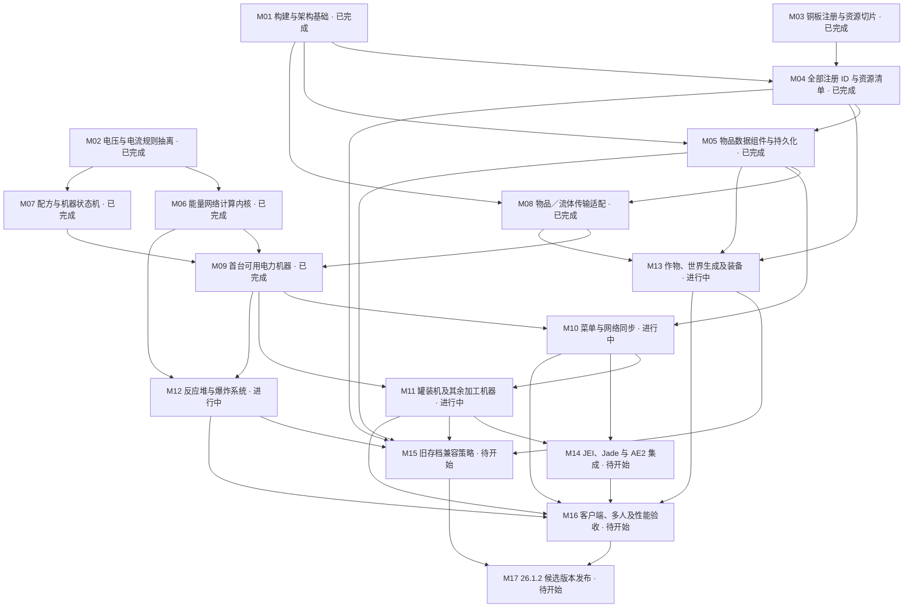

# NeoForge 26.1.2 迁移进度

更新：2026-09-08 · Minecraft 26.1.2 / NeoForge 26.1.2.107 / Java 25

阶段完成：**9 / 17**。完整迁移的旧 Java 文件：**2 / 938**。

这些计数不表示功能完成率或工时进度。当前是迁移开发版本，旧机器与旧世界兼容性仍待验收。

此页由 `plan.json` 生成；修改后运行 `python3 tools/migration/progress.py`。

| 任务 | 状态 | 前置任务 | 验收标准 |
|---|---|---|---|
| M01 构建与架构基础 | 已完成 | — | Java 25 构建、核心单测、平台启动测试、CI 和进度校验全部通过。 |
| M02 电压与电流规则抽离 | 已完成 | — | 独立于 Minecraft 编译；覆盖六档电压、边界、溢出和机器设置切换。 |
| M03 铜板注册与资源切片 | 已完成 | — | 保留 ic2:copper_plate；注册、模型、纹理及语言可解析；专服 GameTest 通过。客户端外观另由 M16 验收。 |
| M04 全部注册 ID 与资源清单 | 已完成 | M01, M03 | 逐项登记旧物品、方块、实体、菜单 ID；每项明确保留、替换或废弃；材质和模型检查通过。 |
| M05 物品数据组件与持久化 | 已完成 | M01, M04 | 用数据组件表达电量、流体、遥控绑定；保存与网络 Codec 往返测试；无静态 ItemStack 初始化。 |
| M06 能量网络计算内核 | 已完成 | M02 | 抽离拓扑、损耗和分配规则；能量守恒、过压、断网重连测试；世界访问通过接口注入。 |
| M07 配方与机器状态机 | 已完成 | M02 | 先迁移单输入机器；配方匹配、进度、暂停和产出以纯逻辑测试覆盖；无全局 IC2 服务读取。 |
| M08 物品／流体传输适配 | 已完成 | M01, M05 | 对接 26.1.2 传输 API；模拟与提交一致；容量、侧面权限和回滚测试通过。 |
| M09 首台可用电力机器 | 已完成 | M06, M07, M08 | 发电机—导线—电炉的最小链路；耗能、配方、存取、区块重载与专服 GameTest 通过。 |
| M10 菜单与网络同步 | 进行中 | M05, M09 | 类型化 payload、服务端校验；双人交互与断线重连；客户端渲染 API 更新。 |
| M11 罐装机及其余加工机器 | 进行中 | M09, M10 | 按机器族拆分后续提交；优先覆盖 cannerfix1 路径，再覆盖升级、泵、存储和高阶机器。 |
| M12 反应堆与爆炸系统 | 进行中 | M06, M09 | 热量规则独立测试；反应堆、核弹、炸药与遥控的游戏回归；权限与持久化验证。 |
| M13 作物、世界生成及装备 | 进行中 | M04, M05, M08 | 进入阶段前按作物／树木矿物／工具装备拆子任务；资源生成和存档重载测试。 |
| M14 JEI、Jade 与 AE2 集成 | 待开始 | M10, M11 | 按实际支持 26.1.2 的版本接入；每个集成独立边界；缺少可选模组仍能启动。 |
| M15 旧存档兼容策略 | 待开始 | M04, M05, M11, M12, M13 | 在副本上验证 ID、NBT 和版本跨度；给出可复现转换流程，或明确不支持的项目。 |
| M16 客户端、多人及性能验收 | 待开始 | M10, M11, M12, M13, M14 | 客户端视觉检查、双人专服、保存重载与性能基线；不得以编译通过替代功能验收。 |
| M17 26.1.2 候选版本发布 | 待开始 | M15, M16 | 功能对照清单审查、完整构建、校验和与 Actions 候选 Release；此阶段前只发 CI 开发产物。 |

## 注册迁移覆盖

| 注册类别 | 已实现 | 部分实现 | 基线总数 |
|---|---:|---:|---:|
| item | 202 | 174 | 528 |
| block | 38 | 102 | 264 |
| block_entity | 1 | 72 | 157 |
| entity | 0 | 0 | 8 |
| menu | 1 | 22 | 55 |
| sound | 62 | 0 | 62 |
| recipe_serializer | 0 | 16 | 17 |
| recipe_type | 0 | 12 | 13 |
| fluid_family | 0 | 17 | 17 |
| game_event | 5 | 0 | 5 |
| fluid_type | 17 | 0 | 17 |
| fluid | 34 | 0 | 34 |
| configured_feature | 7 | 0 | 7 |
| placed_feature | 10 | 0 | 10 |
| biome_modifier | 4 | 0 | 4 |
| foliage_placer_type | 0 | 1 | 1 |

清单包含 17 个流体族及其动态生成的 85 个实际注册 ID；另含 22 个世界生成注册项；流体族行是分组，不另算功能。完整状态见 [注册清单](registry-catalog.json)。

## 配方迁移覆盖

已转换并纳入加载测试：**657 / 796**。

转换计数不等于生存模式可达率；原料、工具与前置机器仍需逐步验收。

[逐条状态与待迁移原因](recipe-catalog.json)

## 后续工作包

阶段内按可独立验收的功能族推进；进行中表示仍有验收项未完成。

| 工作包 | 阶段 | 状态 | 验收范围 |
|---|---|---|---|
| P01 基础加工与铁炉 | M11 | 进行中 | 配方、事务、随机产出持久化已通过；升级及特殊配方待验收。 |
| P02 罐装机四模式 | M11 | 进行中 | 固体、装填、排空、富集及 cannerfix1 输出边界；升级、全部原料和声音验收。 |
| P03 流体与单元 | M11 | 进行中 | 流体调节器已接入按秒／刻输送及部分接收守恒；17 个流体族、20 个单元；特殊流体世界行为及所有容器交互。 |
| P04 升级与侧面配置 | M11 | 进行中 | 倍率、容量、升级槽与定向自动进出已验证；高级过滤、反相、远程及其他机器待验收。 |
| P05 电力储能与变压器 | M11 | 进行中 | BatBox、CESU、MFE、MFSU、四档变压器；方向、红石、供电模式、过压和重载。 |
| P06 其余发电机 | M11 | 进行中 | 太阳能、地热、半流质、水力、风力、斯特林及动能转电已接入；同位素、其余配置及整体验收待完成。 |
| P07 泵与采矿 | M11 | 进行中 | 泵（面向水源抽取、BFS 源搜索、8,000 mB 罐与自动装桶、进度持久化）已接入并双模式 GameTest 验收；矿机、高级矿机、管道、钻头与过滤待迁移；泵与矿机供液联动随矿机切片。 |
| P08 存储与辅助机器 | M11 | 进行中 | 储液罐已接入事务存储、比较器、容器交互与升级；四级充电垫（站立顺序充电、网络供电、朝向输出）与核材料链已接入并双模式 GameTest 验收；个人保险箱（首开认领、非所有者拒绝、拆除保护）已接入并双模式 GameTest 验收；五材质储物箱（27/45/45/63/126 格、任意面存取）已接入并双模式 GameTest 验收；分拣机（六面×七过滤、默认面回退、20 EU/件路由）已接入并双模式 GameTest 验收；磁化机与铁栅栏（垂直柱搜索、均摊 boost、攀爬速度规则）已接入并双模式 GameTest 验收；交易机（demand/offer 模板、无限与邻接供应库存两种模式）已接入并双模式 GameTest 验收；传送机待迁移；个人保护随 P16。 |
| P09 金属及高阶加工 | M11 | 进行中 | 金属成型、洗矿、离心、回收与感应炉主体已验证；核材料（铀／铀 235／铀 238／钚／小撮系列／MOX／铀燃料丸）与热量门槛离心链（铀分离、RTG 丸回收、小撮压缩）已接入并双模式 GameTest 验收；铁栅栏与磁化机随 P08，完整升级与多人验收待完成。 |
| P10 热力与动能机器 | M11 | 进行中 | 风力／水力动能与五种转子、手动动能、电热、电动动能、固体／流体热源、蒸汽发生器升温／压力／结垢、双级蒸汽动能与完整水循环、冷凝与散热片、电解双气体输出、流体冷却换热、发酵与沼气链、原生事务能力与转电链已接入；蒸汽再压缩（有界热储备、c:steam 候选选择、取热差额修复、零倍率停机）已接入并双模式 GameTest 验收；同位素热源与 RT 发电机（指数输出曲线、单面热输出、燃料不消耗、电池槽充电）已接入并双模式 GameTest 验收；升温换热经核对在恢复源码中无实现依据（热冷却剂仅存在于冷却方向），不作为独立迁移项。 |
| P11 UU 及复制系统 | M11 | 待开始 | 复制、扫描、模式存储和流体 UU；数据与网络同步。 |
| P12 反应堆热量与组件 | M12 | 进行中 | 热量记账、散热片数据与锅炉热爆炸基础已接入；按冷却／交换／反射／燃料组件、网格脉冲、EU／流体模式、热效应和爆炸分步验收。 |
| P13 爆炸与电缆附加行为 | M12 | 待开始 | IC2 爆炸、核弹、炸药、遥控；电击、涂色、建筑泡沫。 |
| P14 树木、矿石与世界生成 | M13 | 已完成 | 矿脉、树苗、橡胶采集、标签及树叶衰减通过；普通新区块与客户端保存重载已验收。 |
| P21 橡胶木建筑部件 | M13 | 已完成 | 按钮、门、栅栏、台阶、告示牌；原生交互、掉落、文字保存和客户端渲染。 |
| P15 作物与农业 | M13 | 待开始 | 作物卡、杂交、养分、生长、收获、农药及种子持久化。 |
| P16 工具与装备 | M13 | 进行中 | 扳手、切线钳、钻头、锯、喷枪、背包与护甲；消耗、附魔、渲染和同步。 |
| P17 可选集成 | M14 | 待开始 | 逐个核对 JEI、Jade、AE2 的目标版本与行为，缺少依赖仍可启动。 |
| P18 旧存档转换 | M15 | 待开始 | 用副本建立跨版本数据迁移工具和可复现流程，列出不支持项。 |
| P19 多人及性能 | M16 | 待开始 | 双人操作、断线、区块加载、重启、资源重载与性能基线。 |
| P20 候选版本 | M17 | 待开始 | 所有清单验收后发布 Actions 候选 Release，保留校验和及回归记录。 |

## 验证证据

- M01：[settings.gradle](../../settings.gradle), [build.gradle](../../core/build.gradle), [build.gradle](../../neoforge/build.gradle), [verification.md](../../docs/migration/verification.md), [build.yml](../../.github/workflows/build.yml), [progress.py](../../tools/migration/progress.py)
- M02：[VoltageTierTest.java](../../core/src/test/java/ic2/core/energy/VoltageTierTest.java), [ElectricalProfileTest.java](../../core/src/test/java/ic2/core/energy/ElectricalProfileTest.java), [verification.md](../../docs/migration/verification.md)
- M03：[ModItems.java](../../neoforge/src/main/java/ic2/neoforge/registration/ModItems.java), [verification.md](../../docs/migration/verification.md), [RegistrationTests.java](../../neoforge/src/gameTest/java/ic2/neoforge/test/RegistrationTests.java), [verify_artifact.py](../../tools/migration/verify_artifact.py)
- M04：[registry-catalog.json](../../docs/migration/registry-catalog.json), [resource-inventory.json](../../docs/migration/resource-inventory.json), [RegistryScanner.java](../../tools/migration/catalog/RegistryScanner.java), [verify_artifact.py](../../tools/migration/verify_artifact.py), [registry-components.md](../../docs/migration/registry-components.md)
- M05：[ModDataComponents.java](../../neoforge/src/main/java/ic2/neoforge/component/ModDataComponents.java), [RemoteLinks.java](../../neoforge/src/main/java/ic2/neoforge/component/RemoteLinks.java), [ComponentTests.java](../../neoforge/src/gameTest/java/ic2/neoforge/test/ComponentTests.java), [registry-components.md](../../docs/migration/registry-components.md)
- M06：[EnergyGraph.java](../../core/src/main/java/ic2/core/energy/grid/EnergyGraph.java), [PacketDistributor.java](../../core/src/main/java/ic2/core/energy/grid/PacketDistributor.java), [EnergyNetworkTest.java](../../core/src/test/java/ic2/core/energy/grid/EnergyNetworkTest.java), [energy-transfer.md](../../docs/migration/energy-transfer.md)
- M07：[MachineProcess.java](../../core/src/main/java/ic2/core/machine/MachineProcess.java), [MachineProcessTest.java](../../core/src/test/java/ic2/core/machine/MachineProcessTest.java), [MachineTests.java](../../neoforge/src/gameTest/java/ic2/neoforge/test/MachineTests.java)
- M08：[ResourcePort.java](../../neoforge/src/main/java/ic2/neoforge/transfer/ResourcePort.java), [TransferTests.java](../../neoforge/src/gameTest/java/ic2/neoforge/test/TransferTests.java), [energy-transfer.md](../../docs/migration/energy-transfer.md)
- M09：[WorldEnergyNetworks.java](../../neoforge/src/main/java/ic2/neoforge/energy/WorldEnergyNetworks.java), [MachineTests.java](../../neoforge/src/gameTest/java/ic2/neoforge/test/MachineTests.java), [first-machines.md](../../docs/migration/first-machines.md)
- M10：[MachineMenu.java](../../neoforge/src/main/java/ic2/neoforge/menu/MachineMenu.java), [MachineScreen.java](../../neoforge/src/main/java/ic2/neoforge/client/MachineScreen.java)
- M11：[ProcessingBlockEntity.java](../../neoforge/src/main/java/ic2/neoforge/machine/ProcessingBlockEntity.java), [ProcessingRecipe.java](../../neoforge/src/main/java/ic2/neoforge/recipe/ProcessingRecipe.java), [work-packages.json](../../docs/migration/work-packages.json), [canner-fluids.md](../../docs/migration/canner-fluids.md)
- M12：[condenser.md](../../docs/migration/condenser.md), [ReactorHeatTest.java](../../core/src/test/java/ic2/core/reactor/ReactorHeatTest.java), [CondenserTests.java](../../neoforge/src/gameTest/java/ic2/neoforge/test/CondenserTests.java), [heat-explosions.md](../../docs/migration/heat-explosions.md)
- M13：[work-packages.json](../../docs/migration/work-packages.json), [tools.md](../../docs/migration/tools.md)

## 依赖关系

[架构与工作约定](architecture.md) · [原始文件清单](legacy-inventory.json)
