# NeoForge 26.1.2 迁移进度

更新：2026-09-08 · Minecraft 26.1.2 / NeoForge 26.1.2.107 / Java 25

阶段完成：**9 / 17**。完整迁移的旧 Java 文件：**2 / 938**。

这些计数不表示功能完成率或工时进度。当前是迁移开发版本，旧机器与旧世界兼容性仍待验收。

此页由 `plan.json` 生成；修改后运行 `python3 tools/migration/progress.py`。

| 任务 | 状态 | 前置任务 | 验收标准 |
|---|---|---|---|
| M01 构建与架构基础 | 已完成 | — | Java 25 构建、核心单测、平台启动测试、CI 和进度校验全部通过。 |
| M02 电压与电流规则抽离 | 已完成 | — | 独立于 Minecraft 编译；覆盖六档电压、边界、溢出和机器设置切换。 |
| M03 铜板注册与资源切片 | 已完成 | — | 保留 ic2:copper_plate；注册、模型、纹理及语言可解析；专服 GameTest 通过。客户端外观另由 M16 验收。 |
| M04 全部注册 ID 与资源清单 | 已完成 | M01, M03 | 逐项登记旧物品、方块、实体、菜单 ID；每项明确保留、替换或废弃；材质和模型检查通过。 |
| M05 物品数据组件与持久化 | 已完成 | M01, M04 | 用数据组件表达电量、流体、遥控绑定；保存与网络 Codec 往返测试；无静态 ItemStack 初始化。 |
| M06 能量网络计算内核 | 已完成 | M02 | 抽离拓扑、损耗和分配规则；能量守恒、过压、断网重连测试；世界访问通过接口注入。 |
| M07 配方与机器状态机 | 已完成 | M02 | 先迁移单输入机器；配方匹配、进度、暂停和产出以纯逻辑测试覆盖；无全局 IC2 服务读取。 |
| M08 物品／流体传输适配 | 已完成 | M01, M05 | 对接 26.1.2 传输 API；模拟与提交一致；容量、侧面权限和回滚测试通过。 |
| M09 首台可用电力机器 | 已完成 | M06, M07, M08 | 发电机—导线—电炉的最小链路；耗能、配方、存取、区块重载与专服 GameTest 通过。 |
| M10 菜单与网络同步 | 进行中 | M05, M09 | 类型化 payload、服务端校验；双人交互与断线重连；客户端渲染 API 更新。 |
| M11 罐装机及其余加工机器 | 进行中 | M09, M10 | 按机器族拆分后续提交；优先覆盖 cannerfix1 路径，再覆盖升级、泵、存储和高阶机器。 |
| M12 反应堆与爆炸系统 | 进行中 | M06, M09 | 热量规则独立测试；反应堆、核弹、炸药与遥控的游戏回归；权限与持久化验证。 |
| M13 作物、世界生成及装备 | 进行中 | M04, M05, M08 | 进入阶段前按作物／树木矿物／工具装备拆子任务；资源生成和存档重载测试。 |
| M14 JEI、Jade 与 AE2 集成 | 待开始 | M10, M11 | 按实际支持 26.1.2 的版本接入；每个集成独立边界；缺少可选模组仍能启动。 |
| M15 旧存档兼容策略 | 待开始 | M04, M05, M11, M12, M13 | 在副本上验证 ID、NBT 和版本跨度；给出可复现转换流程，或明确不支持的项目。 |
| M16 客户端、多人及性能验收 | 待开始 | M10, M11, M12, M13, M14 | 客户端视觉检查、双人专服、保存重载与性能基线；不得以编译通过替代功能验收。 |
| M17 26.1.2 候选版本发布 | 待开始 | M15, M16 | 功能对照清单审查、完整构建、校验和与 Actions 候选 Release；此阶段前只发 CI 开发产物。 |

## 注册迁移覆盖

| 注册类别 | 已实现 | 部分实现 | 基线总数 |
|---|---:|---:|---:|
| item | 306 | 179 | 528 |
| block | 120 | 106 | 264 |
| block_entity | 10 | 76 | 157 |
| entity | 8 | 0 | 8 |
| menu | 4 | 26 | 55 |
| sound | 62 | 0 | 62 |
| recipe_serializer | 1 | 16 | 17 |
| recipe_type | 0 | 12 | 13 |
| fluid_family | 1 | 16 | 17 |
| game_event | 5 | 0 | 5 |
| fluid_type | 17 | 0 | 17 |
| fluid | 34 | 0 | 34 |
| configured_feature | 7 | 0 | 7 |
| placed_feature | 10 | 0 | 10 |
| biome_modifier | 4 | 0 | 4 |
| foliage_placer_type | 0 | 1 | 1 |

清单包含 17 个流体族及其动态生成的 85 个实际注册 ID；另含 22 个世界生成注册项；流体族行是分组，不另算功能。完整状态见 [注册清单](registry-catalog.json)。

## 配方迁移覆盖

已转换并纳入加载测试：**755 / 796**。

转换计数不等于生存模式可达率；原料、工具与前置机器仍需逐步验收。

[逐条状态与待迁移原因](recipe-catalog.json)

## 后续工作包

阶段内按可独立验收的功能族推进；进行中表示仍有验收项未完成。

| 工作包 | 阶段 | 状态 | 验收范围 |
|---|---|---|---|
| P01 基础加工与铁炉 | M11 | 进行中 | 配方、事务、随机产出持久化已通过；升级及特殊配方待验收。 |
| P02 罐装机四模式 | M11 | 进行中 | 固体、装填、排空、富集及 cannerfix1 输出边界；升级、全部原料和声音验收。 |
| P03 流体与单元 | M11 | 进行中 | 流体调节器已接入按秒／刻输送及部分接收守恒；17 个流体族、20 个单元；特殊流体世界行为及所有容器交互。 |
| P04 升级与侧面配置 | M11 | 进行中 | 倍率、容量、升级槽与定向自动进出已验证；高级过滤、反相、远程及其他机器待验收。 |
| P05 电力储能与变压器 | M11 | 进行中 | BatBox、CESU、MFE、MFSU、四档变压器；方向、红石、供电模式、过压和重载。 |
| P06 其余发电机 | M11 | 进行中 | 太阳能、地热、半流质、水力、风力、斯特林及动能转电已接入；同位素、其余配置及整体验收待完成。 |
| P07 泵与采矿 | M11 | 进行中 | 泵（面向水源抽取、BFS 源搜索、8,000 mB 罐与自动装桶、进度持久化）已接入并双模式 GameTest 验收；矿机、高级矿机、管道、钻头与过滤待迁移；泵与矿机供液联动随矿机切片。 |
| P08 存储与辅助机器 | M11 | 进行中 | 储液罐已接入事务存储、比较器、容器交互与升级；四级充电垫（站立顺序充电、网络供电、朝向输出）与核材料链已接入并双模式 GameTest 验收；个人保险箱（首开认领、非所有者拒绝、拆除保护）已接入并双模式 GameTest 验收；五材质储物箱（27/45/45/63/126 格、任意面存取）已接入并双模式 GameTest 验收；分拣机（六面×七过滤、默认面回退、20 EU/件路由）已接入并双模式 GameTest 验收；磁化机与铁栅栏（垂直柱搜索、均摊 boost、攀爬速度规则）已接入并双模式 GameTest 验收；交易机（demand/offer 模板、无限与邻接供应库存两种模式）已接入并双模式 GameTest 验收；传送机待迁移；个人保护随 P16。特斯拉线圈已接入：TeslaCoilBlockEntity（10000 EU/等级 2 sink、红石门控、待机 1 EU/t、每 32 tick stored/400 总伤害半径 4 全体 LivingEntity 平分（整除余数丢弃=legacy quirk）、全套 hazmat 免疫（免疫者仍计入分母）、命中再扣 damage×400、ic2:electricity 伤害源、26.1.2 hurtServer boolean 适配、蓝尘粒子、坐标哈希相位对应 legacy random）；配方 shaped/tesla_coil（RRR/RMR/ICI 照搬）+扳手保机器战利品表+legacy 贴图 2 张；账目不变量：满罐单实体 64 tick 后恰 336 EU（GameTest 精确锚定）；双模式 381 项 GameTest 3 项（tesla_coil_shock/gate/hazmat，含 test_instance JSON）验收。能源交易机已接入：EnergyOMatBlockEntity（demand/input/charge+1 升级槽；换物整组入邻箱才成立并付 euOffer=1000 信用（下限 100，menuAction 0-7 八档调价）；paidFor>0 才收电——acceptsFrom 连接级门控+每 tick 到账计量等额扣信用+跨 0 invalidate（粒度一个包如实记录）；10,000 EU 缓冲经充电槽（RE 电池 100 EU/t 传输限制）与正面输出；储能/变压器升级手写结算容量 10000×(1+n)/tier；配方 RBR/CMC+战利品表扳手保机器/普通掉自身（legacy DefaultDrop.Self）+legacy 贴图 4 张；legacy IPersonalBlock 认领随 TradeOMat 同待遇简化如实记录）；双模式 385 项 GameTest 4 项地形改造机已接入：TerraformerBlockEntity（10 万 EU 缓冲、TFBP 逐次付账成功 consume/失败 consume/10、lastPos±range/10 游走+失败扩散封顶 4、右键先弹出后插入手持蓝图、无 GUI 无自动化口、静态 tier-4 sink；blank 空蓝图永续运转零耗 legacy 怪癖忠实保留；扫描工具跳过 barrier/structure_void（GameTest 骨架非地形）、legacy y>=0 扫描下界修复为 world.getMinY()（1.20.1 已是潜在 bug，如实记录）；七个 TFBP 程序 Cultivation/Desertification/Chilling/Irrigation/Flatification/Mushroom 忠实移植（Mushroom NW 条带 off-by-one 保留、运行时群系写入 API 不存在如实跳过、Irrigation 1/48000 降雨经 server.setWeatherParameters）；配方 8 条（7 TFBP+机器本体 GTG/DMD/GDG）+扳手保机器战利品表+legacy 贴图 11 张；双模式 390 项 GameTest 5 项（terraformer_chilling_ledger/energy_gate/blank_blueprint/hand_insert_eject/program_transforms，含 test_instance JSON）验收。 |
| P09 金属及高阶加工 | M11 | 进行中 | 金属成型、洗矿、离心、回收与感应炉主体已验证；核材料（铀／铀 235／铀 238／钚／小撮系列／MOX／铀燃料丸）与热量门槛离心链（铀分离、RTG 丸回收、小撮压缩）已接入并双模式 GameTest 验收；铁栅栏与磁化机随 P08，完整升级与多人验收待完成。 |
| P10 热力与动能机器 | M11 | 进行中 | 风力／水力动能与五种转子、手动动能、电热、电动动能、固体／流体热源、蒸汽发生器升温／压力／结垢、双级蒸汽动能与完整水循环、冷凝与散热片、电解双气体输出、流体冷却换热、发酵与沼气链、原生事务能力与转电链已接入；蒸汽再压缩（有界热储备、c:steam 候选选择、取热差额修复、零倍率停机）已接入并双模式 GameTest 验收；同位素热源与 RT 发电机（指数输出曲线、单面热输出、燃料不消耗、电池槽充电）已接入并双模式 GameTest 验收；升温换热经核对在恢复源码中无实现依据（热冷却剂仅存在于冷却方向），不作为独立迁移项。太阳能蒸馏器已接入：非能量被动流体机 SolarDistillerBlockEntity（双罐各 10000 mB，恒 72 tick 速率——legacy HOT=36/COLD=144 因 EnvProxy biomeHasType 桩恒 false 不可达，按 crops.md 决策取常数），每周期在方块上方取样 SolarGeneration.brightness，亮度 >0.5 且水罐非空、蒸馏罐未满时转化 1 mB 水→蒸馏水；水容器顶部进罐/蒸馏罐底部装桶双向 FluidContainerPort，流体自动化端口全侧面（入水罐只进水、蒸馏罐只出），2 升级槽（legacy GUI 2/声明 3 差异按 GUI 收敛），专用屏幕双罐显示+光照百分比；配方 GGG/G G/CMC（玻璃+machine+facade_cell）与扳手/外壳战利品表落地，registry/recipe catalog 条目转已移植；双模式 374 项 GameTest 3 项（规格端口/昼间周期与夜晚遮罩门控/容器交换，含 test_instance JSON）验收。 |
| P11 UU 及复制系统 | M11 | 进行中 | 水晶记忆盘、uu_scanner（数据包化 UU 价值图＋world-scan 种子集）、pattern_storage、replicator（价值导出 UU 消耗）与 matter_generator 已接入；剩余实机验收、客户端外观与多人同步。 |
| P12 反应堆热量与组件 | M12 | 进行中 | 热量记账、散热片数据与锅炉热爆炸基础已接入；反应堆本体 EU 模式、chamber 扩列、反射／热开关／散热／plating 组件、地表热效果、流体冷却模式与 6×9 满尺寸多方块校验已接入；剩余实机验收、真实电缆链路与多人回归。 |
| P13 爆炸与电缆附加行为 | M12 | 进行中 | 炸药棒方块状态机、遥控器配对群爆、工业TNT（实体/方块/渲染/配方）、投掷/粘性炸药（引信链、PointExplosion、发射器、dynamite_sticky 配方）、Ic2Explosion 射线引擎（Type 五型、吸收/穿越、dropRate 聚合掉落、实体累积伤害含 damageVsEntities、ic2:nuke 与 reactor_explosion 伤害类型）与核弹（NukeBlockEntity 威力公式/装载槽、NukeEntity 300 tick 引信与扳手拆除、NukeMenu 1+8 槽 GUI、enableNuke/nukeExplosionPowerLimit 配置、onBlockExploded 连锁不重复掉落）已接入并双模式 GameTest 验收。建筑泡沫链已交付：FoamBlock 双态光照依赖硬化（normal→泡沫墙浅灰、reinforced→强化石头、沙子速凝）、16 色 IC2 泡沫墙方块、FoamSprayerItem BFS 喷涂（≤10/单块、脚手架就地覆盖、背包优先供液）、CFPackItem 80,000 mB 胸甲罐（护甲 8）、建筑泡沫流体缓慢效果、foam_sprayer/cf_pack 配方（并解锁 remote 两条挂起配方）。涂色器已交付：17 个 PainterItem（无色+16 色，耐久 32）按 legacy 13 分支染原版可染色方块（羊毛/染色玻璃/玻璃板/床/蜡烛/旗帜/陶瓦/带釉陶瓦/混凝土粉末/地毯/混凝土/潜影盒含物品保留）、羊染色、耗尽还原无色刷、autoRefill 潜行切换补料（painter+16 色配方转换 682/796）。电缆电击已交付：PacketDistributor 路径级 RouteLoad 峰值包统计、CableSpec.insulationAbsorption 按 legacy 电力等级表（8/32/128/512/2048，玻璃族永不电击）、WorldEnergyNetworks 对过载导线 1 格 AABB 内活体实体按路径最大值累加 ceil(EU/64) 点 ic2:electricity 伤害（cableShocks 配置开关）；金缆 2048 EU 过压在 IC2 模式先电击后熔毁、GT 模式断路不电击；legacy 剥绝缘分支（阈值 9001）在全部电缆熔毁阈值（capacity+1 ≤ 8193）之上不可达，不迁移。遮蔽墙重纹理已交付：ObscuratorItem 电动物品（100,000 EU/250 EU/t tier2，站立 5,000 EU 应用+潜行客户端 20,000 EU 采样经 ic2:obscurator_scan payload 上行）、ObscuratorReference 数据组件（id+variant+side+colorMuls）、ObscuredWallBlock+ObscuredWallBlockEntity（ValueInput/ValueOutput 持久化、ModelData 发布渲染态、掉落对应墙色泡沫墙）、客户端 ObscuredWallModel（CustomUnbakedBlockStateModel 注册 ic2:obscured_wall，BlockStateModel 逐面输出墙色墙面+MutableQuad 平铺 overlay）与 ObscuredFaceSampler（规整面优先采样，translucent 拒绝）；obscurator 配方转换 683/796。P13 功能面完成：转出项电缆泡沫覆盖随电缆切片、辐射效果随 P16，RetextureEvent 扩展分支无监听者不迁移（见 obscured-wall.md 有意差异）。勘误：legacy ItemRemote 无配对上限（基线与原始反编译均为无界列表），无需迁移。 |
| P14 树木、矿石与世界生成 | M13 | 已完成 | 矿脉、树苗、橡胶采集、标签及树叶衰减通过；普通新区块与客户端保存重载已验收。 |
| P21 橡胶木建筑部件 | M13 | 已完成 | 按钮、门、栅栏、台阶、告示牌；原生交互、掉落、文字保存和客户端渲染。 |
| P15 作物与农业 | M13 | 进行中 | 作物卡、杂交、养分、生长、收获、农药及种子持久化。切片一已接入：作物杆+小麦/杂草卡、生长内核（质量公式/地形三项/存储衰减/杂草扩散）、播种收获拾取闭环与种子袋组件化；剩余其余作物卡、杂交、分析器、Cropmatron、收割机与群系加成。 |
| P16 工具与装备 | M13 | 进行中 | 扳手、切线钳、钻头、锯、喷枪、背包与护甲；消耗、附魔、渲染和同步。辐射链已接入：ic2:radiation 药水与伤害类型、防化四件套（头盔/胸甲/护腿/橡胶靴）全套豁免火/电/辐射、核爆辐射环与反应堆 70% 热辐射。电链锯已接入：ChainsawItem（30000 EU/100 传输/等级 1、斧速 12 且普通挖掘与蜘蛛网免费、剪切模式默认开经潜行+use 切换 chainsaw_disable_shear 组件、可剪切方块破坏掉自身耗 100 EU 经 BreakBlockEvent 替代已移除的 onBlockStartBreak、右键剪 Shearable 与攻击各耗 100 EU（+11 攻伤/-3 攻速）、铁矿板+动力单元与钢锭+电路+RE 电池两条配方）已接入并双模式 GameTest 4 项验收；电动背包已接入：BatPack/AdvBatPack（60000/100/t1 与 600000/1000/t2、胸甲槽、外部可放电、legacy 材料 8 点胸甲/韧性 2.0 经数据组件、穿着层贴图）；ElectricItemEnergy.use 复刻 legacy manager.use 先充后耗分配（chargeFromArmor 双向忽略上限、护甲等级门控、canUse 先行门控空钻不拉电），链锯/钻头/电动扳手/电动树洞钻消耗路径接入；生物剪切改走 NeoForge IShearable（onSheared+spawnShearedDrop 对应 legacy IForgeShearable）；test_instance JSON 缺失致上轮链锯 4 测试未运行已勘误补齐，双模式 356 项真实执行。已接入并双模式 GameTest 8 项（链锯 4+背包 4）验收；护甲链一已接入：ElectricArmorItem 动态充能属性（CHARGED_PROTECTION {3,6,8,3}、未充能回落 NANO_SUIT 材料 0 防；纳米服不携带静态属性组件以避免遮蔽 getDefaultAttributeModifiers(ItemStack) 回落）+ NanoSuit 四件（1M EU/1600/t3、damageArmor 吸收占比 0.15/0.3/0.4×0.9、5000 EU/点、BYPASSES 门控、LivingFallEvent 纳米靴摔落吸收、UNCOMMON）+ Night Vision Goggles（200k/200/t1、durability 27、头盔 3 防、无减伤），夜视共享 NightVisionHelper（潜行+use 切换 night_vision_active 组件、1 EU/t、天空光>8 失明），四条纳米配方（goggles 配方因 luminator/reinforced_glass 未移植暂缓），双模式 360 项 GameTest 4 项（含 test_instance JSON）验收；量子服已接入：QuantumSuitItem 四件（10M EU/12000 传输/t4、RARE、复用 ElectricArmorItem 动态充能属性与ElectricArmorHelper 减伤链：20000 EU/点、占比 0.15/0.3/0.4×吸收比率（胸 1.2 余 1.0）、摔落吸收 max(距离−10,0) 无七点上限、charged 充能计 hazmat addsProtection）；QuantumArmorHelper 头盔生命维持（供氧 +200 ticks/1000 EU、饥饿时自动吃罐头 1000 EU、按 legacy potionRemovalCost 付费清除 POISON/radiation[amp×100 递增]/WITHER）、胸甲 clearFire 免费+JetpackLogic 飞行（5% 电量线性降推力、 maxY/0.9 顶高衰减、潜行=悬停 −0.1 下降钳制、消耗 1–2 EU+legacy +6、resetFallDistance）、护腿疾速（sprint 且 onGround/水中 0.22/0.1 推力、10 tick 计数器付 1000 EU、speed_enabled 组件开关）、靴子超级跳（4000 EU 起跳、0.75/t 衰减、sprint 起跳水平 ×3.5）；26.1.2 无 DyeableLeatherItem→数据驱动染色（minecraft:crafting_dye 配方 + DYED_COLOR 组件 + equipment dyeable 层 + item model minecraft:dye tint，createWithOriginalComponents 保留电量）；legacy 键盘依赖降级：模式开关=潜行+use 切组件、前进/加速=isSprinting、悬停=潜行（已记录 UX 待人工）；quantum_helmet 配方因 reinforced_glass 未移植暂缓（已记录），其余三件配方（iridium/lapotron_crystal/alloy|machine+glowstone|rubber_boots）与四条染配方落地，双模式 366 项 GameTest 6 项（含 test_instance JSON）验收；穿戴装备家族二已接入：Lappack（20M EU/2500/t4、外放、UNCOMMON）+ Energypack（2M/1000/t3、外放）+ 太阳能头盔（3 点盔防、按太阳能发电机亮度公式每 tick 给胸甲槽充至多 1 EU、雨天 ×11/16 衰减）+ 静电靴（3 点靴防、水平位移 ≥5 格充 min(3, 距离/5) EU、骑乘/水中冻结标记，static_boots_x/z 组件）+ 电动喷气背包（30k/60/t1、推力 0.7、5% 电量斜坡、1.28 顶高分母、悬停 −0.1）+ 经典喷气背包（30000 mB 沼气罐 FLUID 组件、推力 1.0、20% 斜坡、罐不足整 tick 拒付）；JetpackLogic 共享飞行物理（JetpackLike 参数化），Legacy 键盘依赖降级：潜行+use 切 jetpack_active 组件、潜行=悬停下降、sprint=前进推进；8 条配方（6 主+2 原版盔甲改装变体），创造页 COMBAT（经典背包含满罐堆，对应 legacy fillItemCategory）；双模式 371 项 GameTest 5 项（含 test_instance JSON）验收；喷气背包家族已收尾：jetpack attachment 全链（JETPACK_ATTACHED/JETPACK_CHARGE 组件、JetpackAttachmentRecipe 无图案三件配方：电力背包+非黑名单胸甲（Equippable CHEST 判定，黑名单=经典/电动背包/量子胸/鞘翅）+连接部件、电量转移：电动护甲进自身电池、普通护甲进组件电池上限 30000、JetpackAttachmentHelper 虚拟 JetpackLike 视图（0.7/0.05/0.1/1.28 参数+legacy +6 quirk 扣费 8/7）、破损弹回：受击记录→下 tick 胸空→新电动背包带原电量、键盘降级：sneak+use 切 jetpack_active 并取消原版装备替换、tooltip 黄行+EU 行）；经典喷气背包世界侧充装（JetpackTankHandler：Fluid.ITEM capability、30000 mB 沼气限定 isValid、FLUID 组件写回、TANK 右键经 MachineBlock.useItemOn→FluidUtil 端到端充装）；JetpackAttachmentPlateItem 三行 tooltip；双模式 378 项 GameTest 4 项（jetpack_attachment_recipe/attached_flight/pop_back/world_fill，含 test_instance JSON）验收。 |
| P17 可选集成 | M14 | 待开始 | 逐个核对 JEI、Jade、AE2 的目标版本与行为，缺少依赖仍可启动。 |
| P18 旧存档转换 | M15 | 已完成 | 用副本建立跨版本数据迁移工具和可复现流程，列出不支持项。 |
| P19 多人及性能 | M16 | 已完成 | 双人操作、断线、区块加载、重启、资源重载与性能基线。 |
| P20 候选版本 | M17 | 待开始 | 所有清单验收后发布 Actions 候选 Release，保留校验和及回归记录。 |

## 验证证据

- M01：[settings.gradle](../../settings.gradle), [build.gradle](../../core/build.gradle), [build.gradle](../../neoforge/build.gradle), [verification.md](../../docs/migration/verification.md), [build.yml](../../.github/workflows/build.yml), [progress.py](../../tools/migration/progress.py)
- M02：[VoltageTierTest.java](../../core/src/test/java/ic2/core/energy/VoltageTierTest.java), [ElectricalProfileTest.java](../../core/src/test/java/ic2/core/energy/ElectricalProfileTest.java), [verification.md](../../docs/migration/verification.md)
- M03：[ModItems.java](../../neoforge/src/main/java/ic2/neoforge/registration/ModItems.java), [verification.md](../../docs/migration/verification.md), [RegistrationTests.java](../../neoforge/src/gameTest/java/ic2/neoforge/test/RegistrationTests.java), [verify_artifact.py](../../tools/migration/verify_artifact.py)
- M04：[registry-catalog.json](../../docs/migration/registry-catalog.json), [resource-inventory.json](../../docs/migration/resource-inventory.json), [RegistryScanner.java](../../tools/migration/catalog/RegistryScanner.java), [verify_artifact.py](../../tools/migration/verify_artifact.py), [registry-components.md](../../docs/migration/registry-components.md)
- M05：[ModDataComponents.java](../../neoforge/src/main/java/ic2/neoforge/component/ModDataComponents.java), [RemoteLinks.java](../../neoforge/src/main/java/ic2/neoforge/component/RemoteLinks.java), [ComponentTests.java](../../neoforge/src/gameTest/java/ic2/neoforge/test/ComponentTests.java), [registry-components.md](../../docs/migration/registry-components.md)
- M06：[EnergyGraph.java](../../core/src/main/java/ic2/core/energy/grid/EnergyGraph.java), [PacketDistributor.java](../../core/src/main/java/ic2/core/energy/grid/PacketDistributor.java), [EnergyNetworkTest.java](../../core/src/test/java/ic2/core/energy/grid/EnergyNetworkTest.java), [energy-transfer.md](../../docs/migration/energy-transfer.md)
- M07：[MachineProcess.java](../../core/src/main/java/ic2/core/machine/MachineProcess.java), [MachineProcessTest.java](../../core/src/test/java/ic2/core/machine/MachineProcessTest.java), [MachineTests.java](../../neoforge/src/gameTest/java/ic2/neoforge/test/MachineTests.java)
- M08：[ResourcePort.java](../../neoforge/src/main/java/ic2/neoforge/transfer/ResourcePort.java), [TransferTests.java](../../neoforge/src/gameTest/java/ic2/neoforge/test/TransferTests.java), [energy-transfer.md](../../docs/migration/energy-transfer.md)
- M09：[WorldEnergyNetworks.java](../../neoforge/src/main/java/ic2/neoforge/energy/WorldEnergyNetworks.java), [MachineTests.java](../../neoforge/src/gameTest/java/ic2/neoforge/test/MachineTests.java), [first-machines.md](../../docs/migration/first-machines.md)
- M10：[MachineMenu.java](../../neoforge/src/main/java/ic2/neoforge/menu/MachineMenu.java), [MachineScreen.java](../../neoforge/src/main/java/ic2/neoforge/client/MachineScreen.java)
- M11：[ProcessingBlockEntity.java](../../neoforge/src/main/java/ic2/neoforge/machine/ProcessingBlockEntity.java), [ProcessingRecipe.java](../../neoforge/src/main/java/ic2/neoforge/recipe/ProcessingRecipe.java), [work-packages.json](../../docs/migration/work-packages.json), [canner-fluids.md](../../docs/migration/canner-fluids.md)
- M12：[condenser.md](../../docs/migration/condenser.md), [ReactorHeatTest.java](../../core/src/test/java/ic2/core/reactor/ReactorHeatTest.java), [CondenserTests.java](../../neoforge/src/gameTest/java/ic2/neoforge/test/CondenserTests.java), [heat-explosions.md](../../docs/migration/heat-explosions.md)
- M13：[work-packages.json](../../docs/migration/work-packages.json), [tools.md](../../docs/migration/tools.md)

## 依赖关系

```mermaid
flowchart TD
  M01["M01 构建与架构基础 · 已完成"]
  M02["M02 电压与电流规则抽离 · 已完成"]
  M03["M03 铜板注册与资源切片 · 已完成"]
  M04["M04 全部注册 ID 与资源清单 · 已完成"]
  M01 --> M04
  M03 --> M04
  M05["M05 物品数据组件与持久化 · 已完成"]
  M01 --> M05
  M04 --> M05
  M06["M06 能量网络计算内核 · 已完成"]
  M02 --> M06
  M07["M07 配方与机器状态机 · 已完成"]
  M02 --> M07
  M08["M08 物品／流体传输适配 · 已完成"]
  M01 --> M08
  M05 --> M08
  M09["M09 首台可用电力机器 · 已完成"]
  M06 --> M09
  M07 --> M09
  M08 --> M09
  M10["M10 菜单与网络同步 · 进行中"]
  M05 --> M10
  M09 --> M10
  M11["M11 罐装机及其余加工机器 · 进行中"]
  M09 --> M11
  M10 --> M11
  M12["M12 反应堆与爆炸系统 · 进行中"]
  M06 --> M12
  M09 --> M12
  M13["M13 作物、世界生成及装备 · 进行中"]
  M04 --> M13
  M05 --> M13
  M08 --> M13
  M14["M14 JEI、Jade 与 AE2 集成 · 待开始"]
  M10 --> M14
  M11 --> M14
  M15["M15 旧存档兼容策略 · 待开始"]
  M04 --> M15
  M05 --> M15
  M11 --> M15
  M12 --> M15
  M13 --> M15
  M16["M16 客户端、多人及性能验收 · 待开始"]
  M10 --> M16
  M11 --> M16
  M12 --> M16
  M13 --> M16
  M14 --> M16
  M17["M17 26.1.2 候选版本发布 · 待开始"]
  M15 --> M17
  M16 --> M17
```

[架构与工作约定](architecture.md) · [原始文件清单](legacy-inventory.json)
