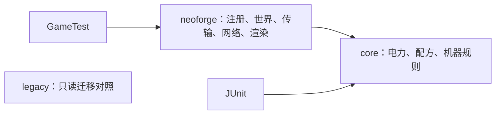

# 迁移架构与工作约定

目标是逐步替换平台耦合的旧实现，每次提交应能独立构建、说明行为变化并给出验证证据。

- `core` 只依赖 Java 标准库；测试库只进入测试类路径。规则接收显式输入，输出状态或结果；避免全局单例服务和世界对象。
- `neoforge` 负责平台生命周期。仅入口协调模块注册，物品、机器、网络、客户端各自拥有职责；客户端类不得进入专服入口。
- `legacy/forge-1.20.1` 保留 938 个 Java 文件及资源，不参与新构建。其源码 SHA-256 由清单锁定；不能把移入目录算作迁移完成。构建旧版请 checkout `forge/1.20.1`，历史恢复文档中的 `src` 路径以该分支为准。
- 新模组 JAR 内嵌 `core` 编译输出；开发运行也装载该模块。无需额外安装一个 core 模组。
- 不为了现代语法而机械改写。不可变值适合 record；机器运行状态需要更新时允许封装的可变对象。暂不引入抽象服务框架或通用机器继承树。
- 版本全部固定。更新目标版本、MDG 或测试库必须独立验证，禁止动态 `+` 版本。

## 第一批行为与兼容性

`VoltageTier` 和 `ElectricalProfile` 从旧包迁入 `ic2.core.energy`；这是新主版本开发 API，尚不承诺旧 Java API 二进制兼容。电压字段改为私有，通过现有 getter 读取。电流公式保持原语义，改用 long 中间值的整数运算，并覆盖 Integer.MAX_VALUE。

`fromPower` 改用顺序阈值判断，修复在 32/128 等边界的相邻浮点数上，对数舍入可能返回过低档位的问题；NaN、负值和无限值保持原来的饱和／回退语义。工作电压不允许 null，在赋值入口立即报错；输入电压 null 仍表示回退。此类仍是由服务器线程持有的可变设置，不声称线程安全。

铜板保留 `ic2:copper_plate`，沿用原纹理和模型，补充 26.1.2 所需的 `assets/ic2/items` 定义。它仅验证首项内容接入；旧 `Ic2Items` 中其余注册尚未完成，不能将整个文件记为已迁移。

## 任务与验收

`plan.json` 是任务状态、依赖、验收标准和迁移映射的唯一来源。开始一个阶段前，把较大的机器族／内容族任务拆为可在一个 PR 审查的子任务；每项列出受影响 ID、输入输出、兼容性决策及测试。后续估算以完成切片的实际复杂度为依据，不按行数估工期。

状态仅有 `todo`、`in_progress`、`done`、`blocked`；完成状态必须有仓库内证据且前置任务完成。`ports` 只记录整个旧文件职责已落地的映射，部分拆出另在任务证据中记录。任务完成数不等于功能百分比，文件数也不等于工作量。

修改状态后运行 `python3 tools/migration/progress.py`；提交生成的 `docs/migration/STATUS.md`。CI 运行 `--check`，检测过期看板、依赖、缺失证据、旧源码变动和模块边界。

## 验证层次

1. JUnit：边界、守恒、状态转换与历史行为。
2. GameTest：真实注册表、世界和平台传输交互；测试代码通过独立开发源集装载，不打入用户模组。
3. 客户端与多人手工验收：模型、GUI、同步、长时间负载。
4. 旧存档只在副本验证；完成 M15 前不宣称可直接升级 1.20.1 世界。

## 工具链依据

- [NeoForge 26.1 入门：Java 25](https://docs.neoforged.net/docs/gettingstarted/)
- [26.1 平台变化](https://neoforged.net/news/26.1release/)
- [官方 26.1.2 MDG 模板](https://github.com/NeoForgeMDKs/MDK-26.1.2-ModDevGradle/tree/27a6e7184401d39b1ebd32a13fec7ceba2ca5c67)：MDG 2.0.146，Gradle 9.2.1。
- [NeoForge Maven 版本清单](https://maven.neoforged.net/releases/net/neoforged/neoforge/maven-metadata.xml)：2026-09-07 固定 26.1.2.107。
