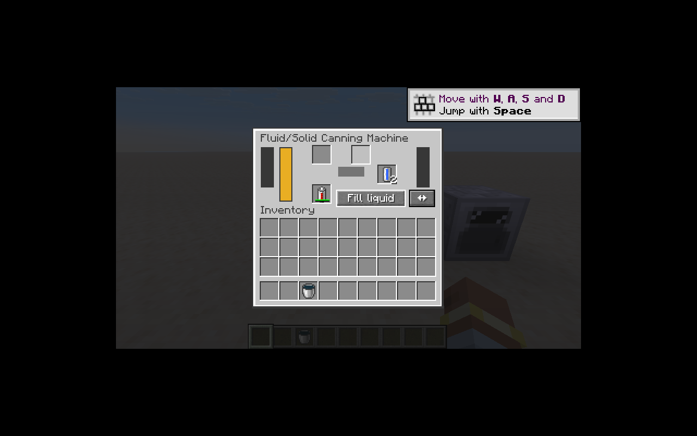

# 罐装机与流体迁移

罐装机使用四个稳定模式 ID，保留 800 EU 缓冲、200 刻／次和 4 EU／刻。
输入、输出各有 8,000 mB 储罐，容器槽与添加剂槽分开。所有加工将库存、储罐、EU 和进度置于同一原生事务中；模拟回滚和实际提交执行同一操作。

- 固体装罐：按配方计数消耗容器与添加剂，堵塞时暂停。
- 装填：输入储罐装入容器，结果进入输出槽。
- 排空：容器液体进入输出储罐；保留旧输入储罐的流体筛选规则。
- 富集：消耗输入液体和添加剂，优先装入容器，余量进入输出储罐。即使输出储罐已满，只要全部结果可装入容器仍能完成；无法容纳全部结果时整体回滚。这是 `cannerfix1` 的重点回归路径。

菜单使用 Minecraft 原生容器槽、整数同步和按钮包。服务器检查当前菜单、距离、方块实体和按钮范围；交换储罐仅允许在进度为零时进行。模式通过方块实体更新包同步给旁观客户端，用于选择循环声。

机器声音由客户端统一管理，以方块实体加载、活动状态、距离、模式、世界切换和声音引擎重载为生命周期边界。声音代码只在客户端包内。

17 个流体族接入 NeoForge 原生流体注册、流体模型和动态桶模型，20 个经典单元保留原 ID。容器的物品交换通过 ItemAccess 与原生事务完成，堆叠容器逐个交换，支持输出堵塞回滚。旧组件若保存了不足一桶的量，会保留实际数量，避免复制液体。

客户端实测使用独立创造平坦世界 `IC2 Migration Smoke`：

1. 带电 RE 电池和两枚水单元进入罐装机，切换排空模式。
2. 得到两枚空单元，输出储罐含 2,000 mB 水。
3. 空闲时交换储罐，切换装填模式，将空单元移入容器槽。
4. 得到两枚水单元，两储罐均为空。菜单、电量条、储罐条、桶与单元模型正常显示。

重启客户端后，以 OpenAL 的 No Output 后端执行了加工中的 F3+T 资源重载，资源与声音引擎重新启动后加工继续，未出现 IC2 异常。这验证了运行路径；听感仍须有声音输出设备的环境验收。

34 项核心单测通过，IC2 与 GT 模式分别通过 27 项 IC2 GameTest 加 1 项 Minecraft 测试。自动化回归见 `CannerTests`、`FluidTests` 和逐条配方加载测试。CI 在 IC2 和 GT 两种供电模式分别运行全部专服测试。

剩余验收：升级模块、燃料棒等尚未迁移原料的配方、特殊流体的世界效果、多人实机交互及声音听感。当前机器和流体族在注册清单中仍标为部分实现。

资源生成顺序：`machines.py` → `material_blocks.py` → `fluids.py` → `tools.py` → `recipes.py`，均位于 `tools/migration/resources/`。

## 第 60 轮审计(2026-09-12)

- 勘误翻 implemented 4 条:recipe_serializer/recipe_type × ic2:canner_bottle、
  ic2:canner_enrich。
- 依据:配方目录与 legacy 文件级 1:1 全量转换(canner_bottle 41 条=
  39 食物罐头+铀/钼燃料棒封装;canner_enrich 4 条=biomass/construction_foam/
  coolant×2),recipe-catalog.json 对应条目全 converted。仅剩 7 条 pending 配方
  均因 tank/fluid_bottler/solid_canner 分歧条目待用户签署,与 canner 序列化器无关。
- 测试:CannerTests 四项(实心封装/装罐排空/富集回滚/状态与按钮)GameTest 通过。
- 验证:IC2/GT 双模式 558×2 全绿;registry 计数 1109/70/20→1130/49/20。
- 留人工:装罐/富集 GUI 实机操作(M16);"尚未迁移原料的配方"随对应物品切片跟进。
