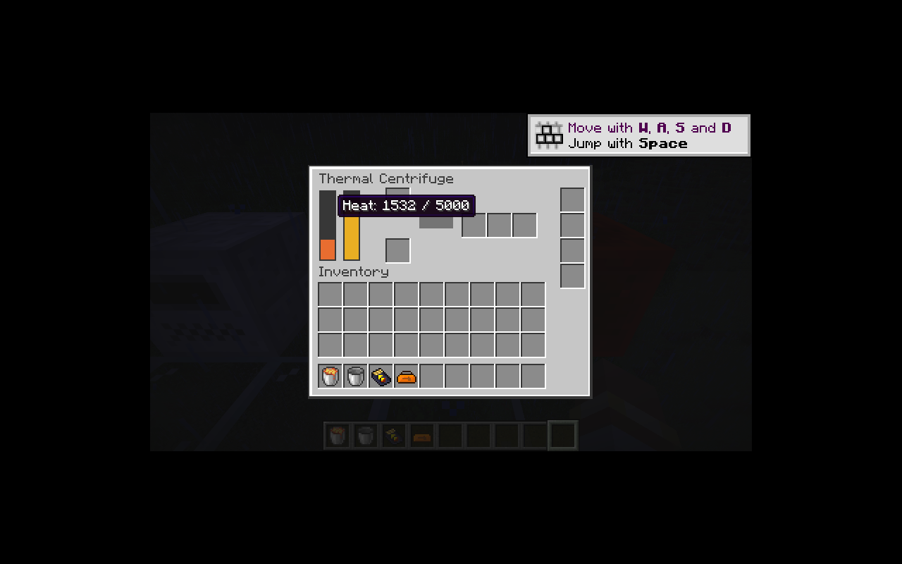

# 热能离心机

离心机基础参数为 500 刻、48 EU/t、MV 128 V、48,000 EU 实际缓冲与三个输出槽。16 条非核燃料加工配方已迁移。十条核材料相关配方待对应放射性物品实现；本体合成仍依赖尚未迁移的采矿激光枪。

核心 `CentrifugeHeat` 处理每次加热 1 EU、冷却 1 单位、切换低温配方时的降温，以及红石输入下预热到 5,000。保留恢复代码的目标加一边界：普通配方稳定在目标 + 1，红石最高温在 5,000／5,001 间变化；界面热量条限制在显示范围内。

加工使用共用多输出事务，达到要求温度才推进。加工之后再运行加热，停止加工且无红石时冷却。副产物阻塞时不请求配方预热，红石仍可维持预热。温度和进度分别持久化，热量不足时暂停进度。

`UpgradeProfile.Base` 明确声明机器基础电压等级及辅助功耗。离心机电池与 IC2 输入为 MV，GT 计算包含额外 1 EU 加热负载。原有低压机器继续采用相同参数。

`MultiOutputRecipe` 共享洗矿和离心配方的原生匹配及展示行为，两个不可变配方记录分别保留水量和最低温度字段。

验证：46 项核心 JUnit；IC2／GT 各 64 项 GameTest（63 项 IC2 + 1 项原版）。覆盖热量边界、缺电冷却、红石预热、辅助功耗跨电压边界、多输出、处理中保存重载及精确 EU。一次精制铁加工核对为 1,500 EU 预热 + 24,000 EU 加工 + 499 EU 保温，重载后仅完成一次。

P09 保持进行中：本体合成依赖、核材料、回收机和感应炉待继续迁移。

客户端已验证红石预热下热量持续增加，热量和 EU 分开显示，三输出槽与升级槽位置正常。画面使用调试注入电量和初始热量，不作为生存合成链已完成的证据。

