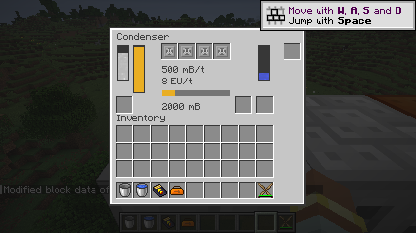
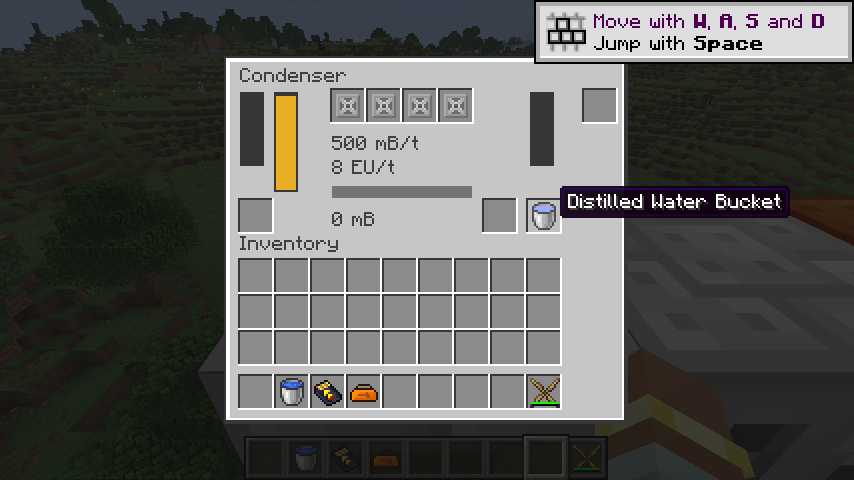

# 冷凝器

`ic2:condenser` 接入 100,000 mB 蒸汽槽、1,000 mB 蒸馏水槽、100,000 EU 缓冲和 HV 512 EU 输入。四个单件散热片槽、底部待填充容器槽、独立返回槽、电池槽和一个升级槽保留。支持物品／流体定向进出、变压器升级；禁止超频和储能升级。变压器同时提高电网和电池允许等级，最高 IV。

纯核心 `Condensation` 计算一步需要的蒸汽、水、电量及下一余额，平台用一个原生事务提交。无散热片时每刻被动处理最多 100 mB；每片增加 100 mB/t 并收取 2 EU/t。四片最多 500 mB/t、8 EU/t。安装散热片后缺电会暂停被动部分，这是恢复版原有行为。少于额定量的最后一口蒸汽仍收取本次散热片费用；没有实际消耗蒸汽则不收电。

普通和过热蒸汽均按 10,000 mB 蒸汽换 100 mB 蒸馏水。保留先交付上一批水、再吸收当刻蒸汽的顺序，因此余额最高可达 10,499 mB。输出空间小于 100 mB 时整步暂停；输出恰好填满时，本刻已经消耗的蒸汽保留为余额。已付清的批次在没有蒸汽或没有电时也能完成。余额和两个流体槽均保存，替换／重载方块实体不会丢失。

所有面接受蒸汽并允许抽取成品，禁止反向提取原料或注入成品。容器填充独立于电力；定向升级复用相同的原生端口。活动指示现在表示当刻确有冷凝或出水，恢复版仅根据原料槽非空点亮。安装部件的菜单逻辑从固定十槽改为读取机器规格，兼容现有十部件机器和冷凝器的四部件槽。

验证覆盖普通／过热蒸汽、批次边界、余额重载、满槽暂停、缺电、安装／拆除散热片、HV→IV 升级、原生能力与事务回滚、容器和定向流体输出，并验证 MFE 实际供电的完整冷凝链。蒸汽生产机和蒸汽动能机尚未迁移，本次测试输入来自测试夹具；不把这条链计为完整蒸汽循环验收。

## 散热片与反应堆基础

`ic2:heat_vent` 使用 `ReactorHeatItem` 保存 1,000 单位热量、每次散热最多 6 单位，移除的热量由调用方记账。`ic2:reactor_heat` 替代旧 `use` NBT，持久化与网络 Codec 拒绝负值。热量独立于工具损伤，不参与普通修理；组件限制单件堆叠，空热量使用组件缺省值。冷凝器把散热片作为风扇使用，不冷却或改变它自身保存的反应堆热量。

不可变 `ReactorHeat` 对正负交换给出同号未接受余量，并用长整型计算避免溢出。恢复版 `ItemReactorHeatStorage.alterHeat` 的正向过热分支返回负余量；新内核修正这个符号。**过热移除、堆体热量和爆炸的处理仍属于待迁移的反应堆宿主，本次没有实现或宣称完成反应堆。**

P12 分为：热量记账／组件数据 → 冷却、交换、反射与燃料组件 → 反应堆网格和脉冲 → EU／流体运行模式 → 热效应、爆炸及持久化。第一部分的边界与 Codec 测试已接入，其余继续推进；完整反应堆仍为进行中。

2026-09-08：84 项核心测试通过；IC2／GT 各 126 项原生 GameTest 全部通过。产物检查覆盖 280 个 Java 25 类、289 个物品定义和 543 个模型依赖；525 条旧 JSON 配方已转换。真实客户端确认四片散热片的速率／费用显示、MFE 供电、蒸汽冷凝及蒸馏水装桶。

