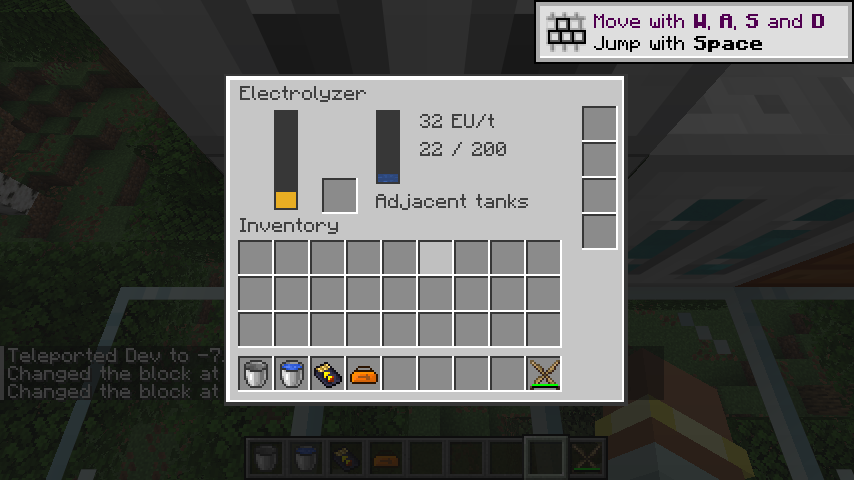
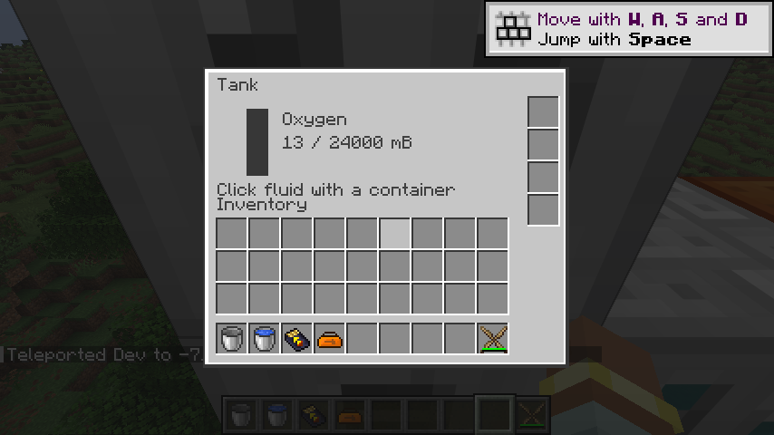

# 电解机

`ic2:electrolyzer` 使用 32,000 EU 缓冲、8,000 mB 输入槽、MV 电池槽和四个流体拉取升级槽。默认每批消耗 40 mB 水，以 32 EU/t 工作 200 刻，向下方储液罐输出 26 mB 氢气、向上方储液罐输出 13 mB 氧气；保留旧版总产物 39 mB 的比例，不擅自改为 40 mB。

`ic2:electrolyzing` 数据包配方定义带组件的输入、每刻 EU、持续刻数，以及一到六个带方向的流体输出。输入、功率、持续时间及输出量必须为正，输入和功率不得超过机器容量，输出不得超过储液罐容量。同一配方不允许重复输出方向。方向相对世界坐标，保留旧版只向相邻 IC2 储液罐输出的限制。

每刻用嵌套原生事务同时试算输入消耗和全部输出。任意一侧不存在、类型不符、未加载或空间不足，试算整体回滚；不消耗当刻电量。最后一刻的 EU、输入流体和全部产物一起提交。沿用恢复版停电或输出堵塞时清零进度的行为，之前消耗的 EU 不退款；输入流体只在整批完成时扣除。

存档记录输入流体、EU、进度和当前配方的完整序列化签名。旧版由通用 `Fluids` 组件保存输入槽，新实现改为显式原生持久化；恢复后相同配方继续已付进度，配方 ID 或内容发生变化时进度清零，避免数据包重载把旧工作量套用于新配方。原生配方缓存随资源重载失效。

最低工作电压为 MV 128 EU，功率较高的数据包配方按旧电压档位提高要求；GT 模式使用 `floor(2 × 配方功率 / 电压) + 1` 的输入安培上限。原生电池放电仍按 MV 物品等级限制。输入流体可从所有面注入、禁止外部抽取；物品自动化无法更换电池或升级。循环音效沿用旧电解机资源。

验证使用真实 CESU 电网、上下储液罐及处理中原生重载，确认完整默认配方恰好消耗 6,400 EU。回归覆盖第二输出槽少 1 mB 时第一输出回滚、恢复空间后同时产出、停电清零、移除输出罐、配方签名变化、输入权限、升级限制，以及自定义东西向输出配方。

数据包配方由旧运行时注册逻辑迁移，独立于 796 条旧 JSON 配方统计。P10 的同位素热源、升温换热、锅炉、蒸汽动能与冷凝仍需迁移；多人及性能验收由 M16 跟踪。

2026-09-08：79 项核心测试、IC2／GT 两种模式各 116 项原生 GameTest 全部通过；产物检查覆盖 268 个 Java 25 类、286 个物品定义及 536 个模型依赖，522 条旧 JSON 配方已转换。真实客户端注水后由 CESU 供电，显示 32 EU/t 和 200 刻处理进度；结束后上罐显示 13 mB 氧气，原生方块数据检查确认下罐 26 mB 氢气。界面、输入水条和音效资源正常加载，无缺失模型警告。

