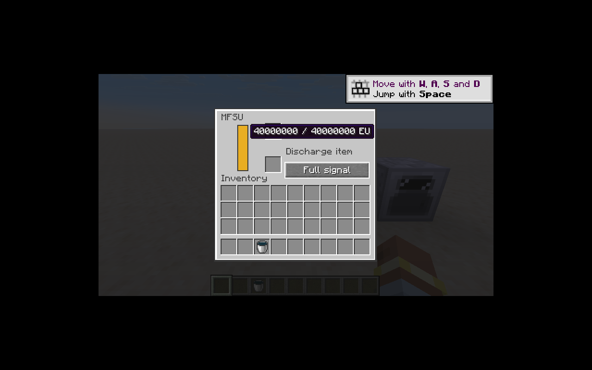
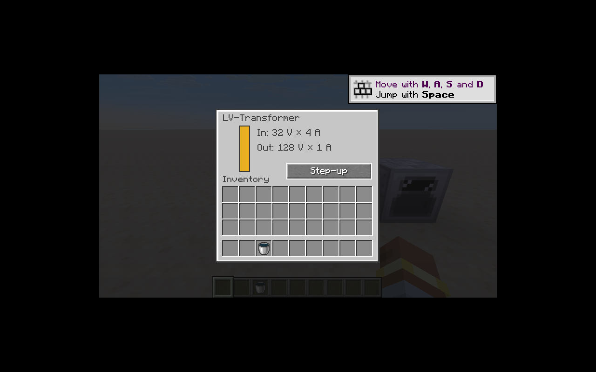

# 电力储能与变压器

四个储能等级共用 `EnergyStorageBlockEntity`，四档变压器共用 `TransformerBlockEntity`。核心模块的 `StorageRedstoneMode` 和 `TransformerMode` 只计算规则，不访问世界。

| 设备 | 储能 EU | 电压 V | GT 输入／输出 A |
|---|---:|---:|---:|
| BatBox | 40,000 | 32 | 2／1 |
| CESU | 300,000 | 128 | 2／1 |
| MFE | 4,000,000 | 512 | 2／1 |
| MFSU | 40,000,000 | 2,048 | 2／1 |

储能设备只从标记面输出，其他五面接收。支持六面朝向；旋转及红石启停会使缓存的有向路径失效。充电与放电槽各一个，遵守物品本身的电压档位、传输上限和堆叠限制。
七个红石模式沿用旧阈值，包括「接近满电发信号」采用 `>=` 而「有红石时输出溢出电量」采用 `>` 的差异。比较器输出按电量比例映射到 0–15。

| 变压器 | 低压 V | 高压 V | 缓冲 EU |
|---|---:|---:|---:|
| LV | 32 | 128 | 256 |
| MV | 128 | 512 | 1,024 |
| HV | 512 | 2,048 | 4,096 |
| EV | 2,048 | 8,192 | 16,384 |

降压时标记面接收高压，其他面输出低压；升压时相反。低压侧为 4A、高压侧为 1A。
IC2 降压输出是四个独立的小电包，不能合成一个四倍大小的电包，否则会误判过压。
保留红石自动、固定降压、固定升压三个模式。GT 下有剩余电量时改变升降压方向会触发故障；初次加载按保存模式初始化，不算运行中的模式切换。

菜单共用原生传输与服务端权限校验。公共能量／进度／燃料字段集中在 `MachineMenuData`，机器专属字段和操作委托给具体方块实体，避免在公共菜单持续叠加具体机器类型判断。MFSU 的 4,000 万 EU 使用两个 16 位属性传输。

验证：36 项核心单测，IC2／GT 各 32 项 IC2 GameTest 加 1 项原版测试通过。`EnergyDeviceTests` 覆盖真实世界的方向变更、红石启停、正反向转换与守恒、存档、充电上限、菜单权限及大数值同步。

客户端在测试世界验证了 MFSU 的 `40000000 / 40000000 EU` 提示和红石模式切换；LV 变压器按钮切换后输入／输出电压和电流随服务器状态更新，资源加载无 IC2 模型或纹理错误。

剩余工作：扳手拆卸时的储能保留、更多装备与充电站、完整 IC2 爆炸传播，以及多人及客户端持续验收。故障目前与首批机器一样采用原版爆炸占位，由 M12 替换。
