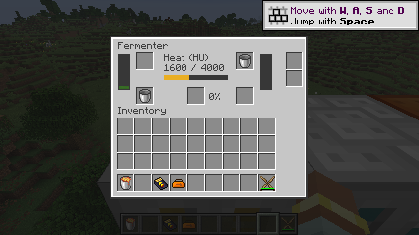
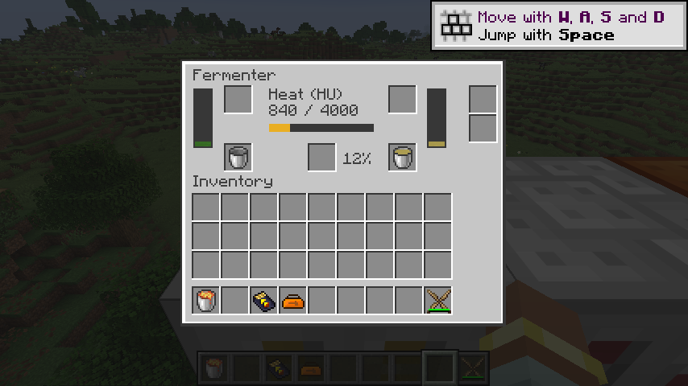

# 发酵机与生物燃料链

`ic2:fermenter` 保留前方取热、10,000 mB 输入槽、2,000 mB 输出槽、两组独立流体容器槽、肥料输出和两个传输升级槽。每刻最多取 100 HU，默认每次用 20 mB 生物质及 4,000 HU 生成 400 mB 沼气，累计处理 500 mB 生物质生成一份肥料。机器每刻最多完成一个批次。

转换规则由原生 `ic2:fermenting` 数据包配方提供，默认资源在 `data/ic2/recipe/fermenting/biomass.json`。`input`、`result` 使用带组件的流体模板；`heat` 和 `fertilizer_interval` 分别控制热量及肥料间隔。旧版初始化时注册的配方现可通过数据包扩展、替换并重载，不再依赖静态配方管理器。默认值保留旧配置；零输入、零热量、零间隔以及超出机器槽容量的批次被拒绝，避免免费产物或无法完成的批次。

核心 `FermentationCycle` 只保存已付热量和肥料累计量。平台在取热前以嵌套事务试算整批流体和肥料是否都能容纳。部分加热只提交实际收到的 HU；完成时热量、输入流体、沼气和肥料在同一个事务内提交。输出堵塞不消耗热量和输入，解堵后可以继续使用已保存热量；即使移除热源，也可使用足额的已付热量完成剩余批次。

相比恢复版，有意保留除法余数而非把肥料进度归零，避免非整除配方丢失累计量；取热量限制为批次尚缺的 HU，避免旧实现每刻无条件索取 100 HU 形成过量缓冲。正整数和 long 中间计算防止配置溢出。重载、换配方保留已付热量；数据包把肥料间隔大幅调小时，如果一次结算超过输出槽容量，机器会暂停并保留累计量。

原生流体能力由组合容器与共用权限视图提供：所有面均能插入符合当前数据包配方的流体，仅能从输出槽抽取。物品容器按旧侧面规则从顶部输入待排空容器、底部输入待充装容器，返回容器与肥料可被抽取。支持物品／流体弹出和拉取升级，拒绝超频、变压及储能升级。所有转移复用 NeoForge 事务传输接口。

界面显示两种流体、已付 HU、肥料累计百分比及独立输入／返回槽；数据使用现有完整 32 位菜单传输。客户端无需镜像配方或机器处理状态。

验证覆盖核心热量付款、余数、重载与大数值；原生服务端覆盖电热源连接、处理中重载、两类产物堵塞、流体容器守恒、端口权限、升级适用性及测试数据包新增配方。完整链验证 20 mB 生物质 + 4,000 HU → 400 mB 沼气，经定向液体弹出升级、半流质发电机与真实电网后得到 6,400 EU。

默认运行时配方独立于 796 条旧 JSON 配方清单，不混入旧 JSON 转换统计。P10 的同位素热源、换热、蒸汽、锅炉、冷凝及电解继续迁移，多人／性能验收由 M16 跟踪。

2026-09-08：77 项核心测试、IC2／GT 两种模式各 104 项原生 GameTest 全部通过；生产产物检查覆盖 254 个 Java 25 类、283 个物品定义和 528 个模型依赖，519 条旧 JSON 配方已转换。真实客户端通过 Shift 输入生物质桶和空桶，确认排空后的返回桶、渐增 HU、沼气自动装桶及肥料累计百分比；无缺失模型警告。

