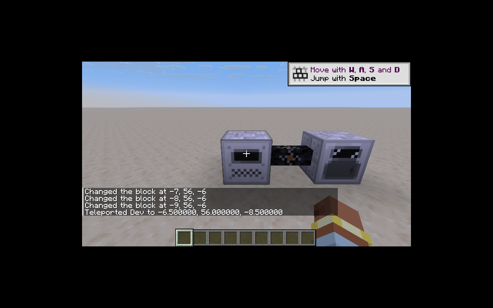
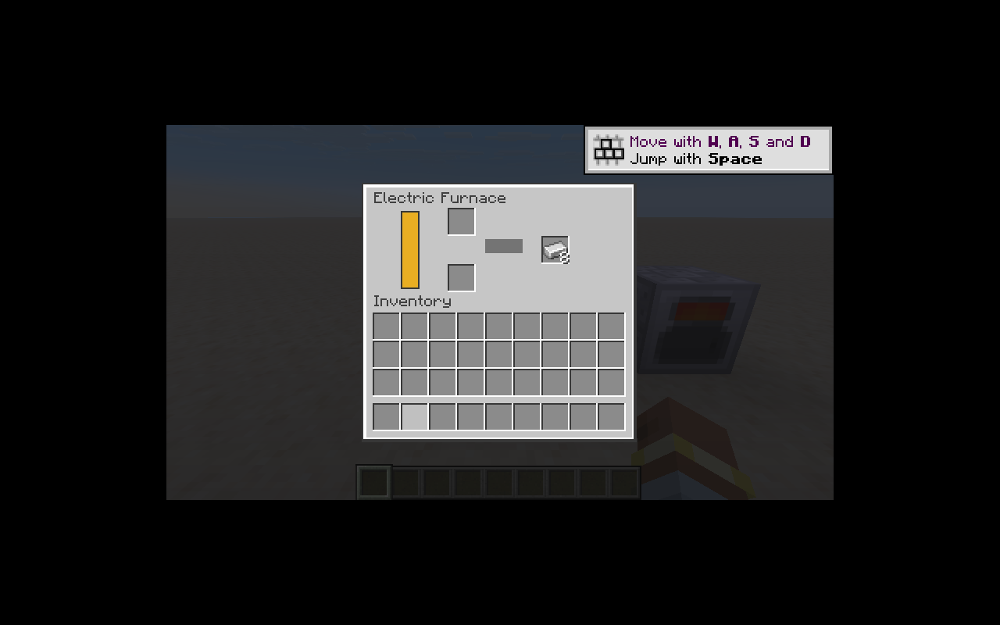

# 第一条世界内机器链路

实现 `generator`、12 种普通导线和 `electric_furnace`，使用原注册 ID。
发电机每刻产生 10 EU，缓存 4000 EU；电炉每次冶炼消耗 300 EU（100 刻，每刻 3 EU）。
沿用原版燃料和可重载的冶炼配方，燃料容器保留在燃料槽。

## 架构

- `WorldEnergyNetworks` 按服务器维度管理拓扑，监听方块、区块与世界生命周期；只访问已加载区块。
- `MachineProcess` / `FuelGenerator` 保持无 Minecraft 依赖；`MachineJournal` 把进度、能量与物品放在同一事务中。
- 方块实体负责持久化与世界适配；界面通过原生容器协议同步槽位和整数数据。32 位数据拆为两个 16 位值，避免协议截断。
- 公共代码无客户端类型。`MachineScreen` 使用 26.1 的渲染状态提取 API。
- 自动化使用 NeoForge 原生事务式物品能力；底面禁止输入，电炉输出槽禁止外部插入，电池槽不开放自动化。
- 导线采用原生 multipart 模型与缓存形状，保留旧纹理，移除对旧 Forge 自定义模型加载器的依赖。

## 自动验证

`MachineTests` 覆盖真实发电机—铜线—电炉冶炼、拆线与接线、保存后继续加工、输出堵塞、燃料容器、满缓存继续燃烧、电池守恒、Shift 搬运和远距离菜单拒绝。
当前 31 项核心单测、13 项 IC2 GameTest（另有 Minecraft 的 always_pass），全部通过。
产物验证器进一步检查方块状态引用的模型、模型父级、纹理、语言、声音和专服依赖边界。

## 尚未验收

这是一条可运行的基础链路，清单中记为「部分实现」。机器升级、导线染色／触电／绝缘破坏、精确 IC2 爆炸、声音循环、合成路径仍需后续实现和回归。
目前过压世界效果使用原生爆炸；M12 将负责原 IC2 爆炸规则。不得据此声明旧机器的全部行为已兼容。
持久化测试验证的是方块实体编码与解码；双人专服及断线重连由 M10/M16 继续跟踪。

## 客户端实测

Linux/Xvfb 客户端进入新建测试世界，放置三段链路，以 GUI Shift 放入煤和粗铁，观察到充电、加工进度、产出和激活纹理。

无声卡与旁白库的开发环境会产生 OpenAL/旁白警告；视觉与服务器逻辑测试不依赖这些设备，音效播放仍需有音频设备的客户端验收。

区块恢复实测：传送至 10000 / 100 / 10000 后，`execute unless loaded -7 56 -6` 确认原区块已经卸载。返回后原有 8 个铁锭保留，再投入 2 个粗铁，恢复供电并产出至 10 个铁锭；超过电炉自身 300 EU 缓存，确认发电机线路恢复工作。
