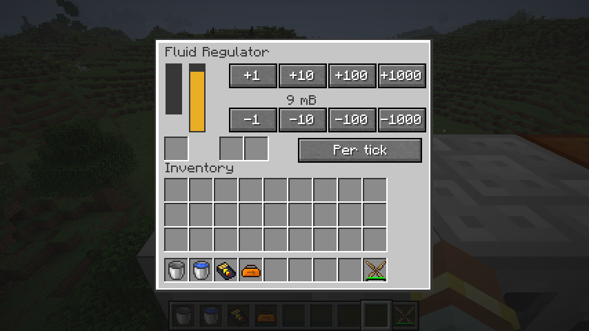
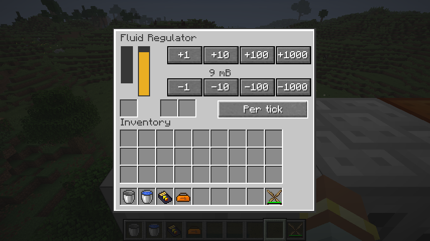

# 流体调节器

`ic2:fluid_regulator` 保留 10,000 mB 流体槽、10,000 EU 缓冲、EV 2048 EU 输入、EV 电池槽，以及顶部待排空容器槽与独立返回槽。可设置 0–1,000 mB，每秒或每刻向正面相邻原生流体能力输送一次；每次实际送达流体时收取固定 10 EU。停电、无目标、目标拒收或速率为零时不扣电、不扣流体。

核心 `FlowRegulator` 管理有界流量、模式和上次成功输送刻。每秒模式按世界时间和位置分散到 20 个相位，不在重载时重置倒计时。成功输送刻写入存档，反复调用或同刻重载不能再次输送。设置模式不会清除已用额度。

目标只接收部分流体时，原生转移事务从源槽扣除实际接收量。恢复版先尝试填入目标，再按配置量扣源槽，导致目标接收 1 mB 却扣除 100 mB 的情形。现在目标仅剩 1 mB 空间时只扣 1 mB，收取一次 10 EU；流体和电量同一个事务提交。

正面只供受计量的主动输送使用，其他面接受外部注入，所有面禁止直接抽取以避免绕过速率。能力视图实时读取朝向，保留旧引用不能绕过转向后的端口权限。扫描相邻目标不主动加载区块。物品自动化只能从顶部放入流体容器并取走返回容器。

菜单使用明确的十种操作 ID：四档 ±1／10／100／1,000 mB，以及每秒／每刻模式。只允许当前有效菜单请求，拒绝未知整数和关闭菜单后的请求；不再把任意网络整数直接加到流量上。菜单帧尺寸、库存坐标由机器规格统一提供，按钮和实际流量通过原生数据同步。

验证覆盖核心设置边界、固定相位与重载额度；原生服务端覆盖部分接收守恒、同刻重载、模式切换、低电量、容器交换、侧面限制、实时转向和菜单权限。P03 的其他流体设备与 P08 的存储辅助机器继续迁移。

2026-09-08：81 项核心测试、IC2／GT 两种模式各 120 项原生 GameTest 全部通过；产物检查覆盖 272 个 Java 25 类、287 个物品定义及 539 个模型依赖，523 条旧 JSON 配方已转换。按秒计数测试使用相隔完整 60 刻的观测点，避免初始相位与测试回调顺序造成的边界歧义。真实客户端注水并由 CESU 供电，确认 ±流量按钮、每秒／每刻切换和邻接储罐输送；底部控件上移后与物品栏标签无重叠。

