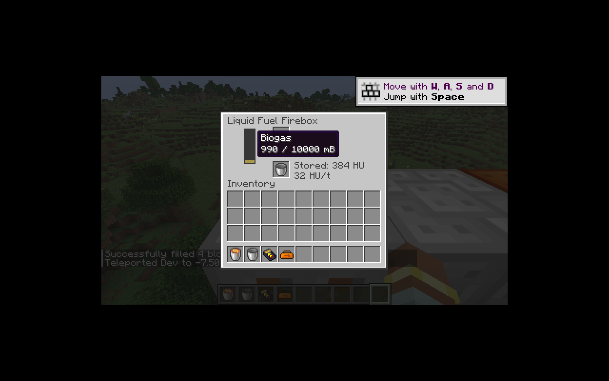
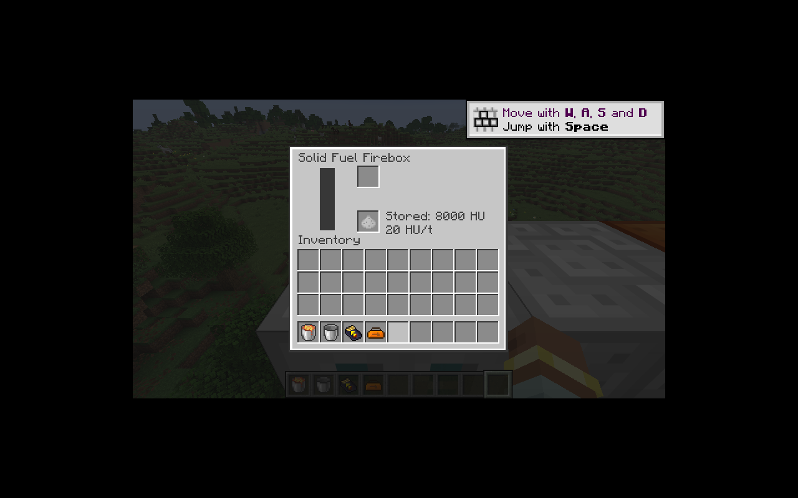

# 固体与流体加热器

新增固体加热器和流体加热器，复用原生热能能力、方向检查和每刻共享输出预算。机器快照、EU 机器和非电力热源现在共用 `StateJournal`；物品、流体和纯 Java 状态仍在同一事务内提交或回滚。`WorkOutput` 统一检查实时朝向、移除状态与抽取预算。

固体加热器采用原版燃烧时间的四分之一，基础输出 20 HU/t，拒绝熔岩桶。煤提供 400 刻、8,000 HU，煤炭块提供 4,000 刻、80,000 HU。保留燃料开始后即使输出满也继续燃烧，以及首刻先燃烧、下一刻才输出的顺序。已产生的热量存入长整数储备，输出端仅按每刻带宽补充；不把超出输出端容量的热量丢掉，也不在储备未耗尽时启动下一份燃料。

修复恢复代码只保存 `fuel` 和输出缓冲、遗漏内部热量储备与原始燃烧时长的问题。燃料结束时有 50% 概率产生一份灰烬；新批次要求灰烬槽有空间。若输出在燃烧中被外部占满，已决定产生的灰烬作为待输出状态保存，不丢失、不在重载后重新抽签。

流体加热器仅接受沼气，10,000 mB 储罐可经原生流体能力或容器装入。每 10 mB 先支付一批 640 HU，基础带宽 32 HU/t。输出满时暂停释放批次，部分需求只扣实际转出的热量，罐空仍可输出已支付的余热。修复旧版先发热 19 次再扣液体、计时不保存和不足 10 mB 仍能发热的问题。该变化刻意避免重载与少量流体产生免费热量。

`solidHeatMultiplier` 与 `fluidHeatMultiplier` 影响新燃料批次，零值禁用新批次；已支付热量及其批次带宽保留。固体输入与输出、流体容器与返还物通过原生库存权限和事务处理。

菜单显示包含内部储备的总热量，大数量采用紧凑单位；存档内部仍保留长整数。所有机器专属菜单字段现在和能量／刻数一样，通过两段 16 位原生数据传输，修复高倍率、流体 ID 和计数器被截断的问题。热量摘要以浮点值传输，仅用于紧凑显示，不参与计算。

验证包含：满输出下燃烧与重载保留 8,000 HU，灰烬堵塞阻止启动，熔岩排除，不足整批流体禁止发热，预付热量重载与暂停，部分输出守恒，长整数储备，以及真实原生菜单数据包传递大数量。10 mB 沼气经流体加热器、斯特林和 BatBox 的完整链路应最终得到 320 EU。

P10 继续进行：同位素热源、热交换、蒸汽、锅炉、冷凝、电解、发酵和其余动能源待迁移；多人及性能仍由 M16 跟踪。

本切片通过 62 项核心 JUnit，IC2／GT 各 88 项 GameTest（87 项 IC2 + 1 项原版）。两种电网均验证 10 mB 沼气最终转成恰好 320 EU；原生有符号短整数数据包验证 19,980,000 HU/t 及约 799 亿 HU 的菜单数值。构建产物边界与资源闭包通过；配方账本为 510 条已转换、286 条待迁移。

客户端实测：沼气桶经输入槽返回空桶，储罐按 10 mB 扣除，并显示运行中的预付余热；固体加热器实际烧完一份煤后保留 8,000 HU，本次燃烧产生一份灰烬。输入由调试命令提供，装入与处理使用实际菜单。

