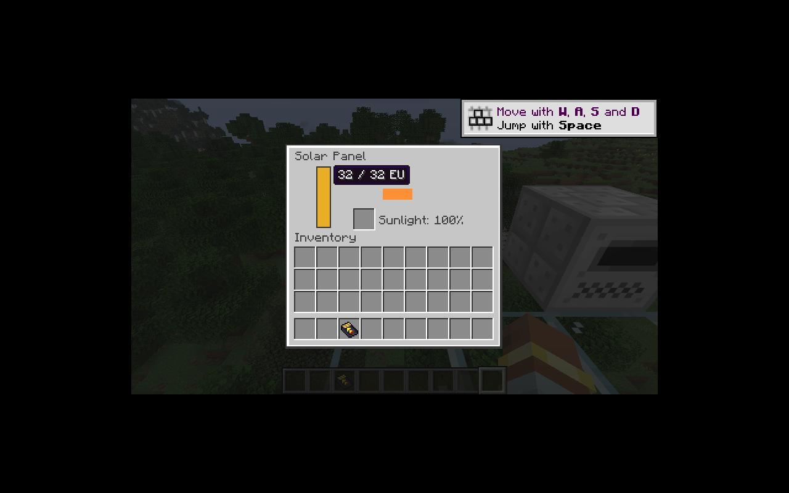
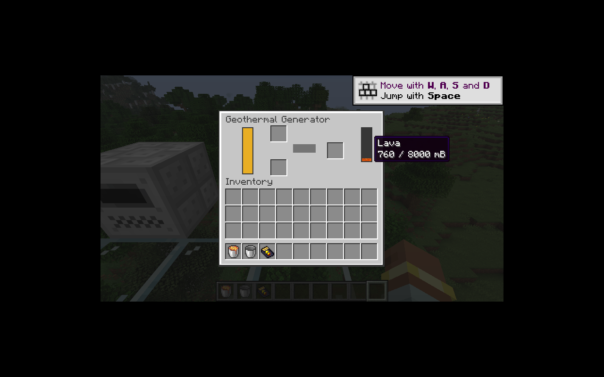

# 附加发电机

太阳能、地热、半流质发电机接入原生电网、充电槽和机器菜单。保留注册 ID 与默认参数：

| 发电机 | 缓冲 | 默认发电 | 燃料 |
|---|---:|---:|---|
| 太阳能 | 32 EU | 0–1 EU/t | 天空光照、太阳角度、天气 |
| 地热 | 2,400 EU | 20 EU/t | 每刻 2 mB 熔岩，8,000 mB 储罐 |
| 半流质 | 32,000 EU | 16 EU/t | 每批 10 mB 沼气持续 10 刻，10,000 mB 储罐 |

三者均以 LV 32 V 向外供电；电池充电沿用原生电量组件。拆卸使用扳手掉自身，普通工具回退为基础发电机，保持旧 DefaultDrop.Generator。

太阳能使用 26.1.2 `EnvironmentAttributes.SUN_ANGLE`，不再调用已经移除的世界太阳角度方法；纯计算在 `SolarGeneration`。每 128 刻采样光照，首次加载立即采样，错开发电机采样刻。雨与雷各乘 `1 - level * 5/16`，`c:is_sandy` 群系保留旧天气豁免。

`FluidFuelBurner` 负责有限燃料批次，平台将燃料、EU 和计数器放在同一事务中。满电暂停，不吞掉尚未燃烧的液体。剩余刻数和实际产能持久化，修正旧半流质机器只保存 fuel、重载可能恢复错误 production 的问题。

流体容器通过原生 ItemAccess 转入储罐，并把空容器送到输出槽；输出阻塞时整体回滚。外部管道只能向燃料槽插入对应燃料，不能抽走燃料。太阳能的充电槽不向自动化开放。

新增纯逻辑测试覆盖光照、天气、维度和燃料暂停／恢复；`GenerationTests` 验证实际日夜及遮挡、熔岩桶回收、满电不消耗燃料、容器输出回滚、沼气保存重载后恰好完成一次。

本地 43 项核心 JUnit、IC2／GT 两种模式各 52 项 GameTest（51 项 IC2 + 1 项原版）通过。

客户端已验证日照提示、实际充电、熔岩桶直接注入与空桶回收；地热发电到 2,400 EU 后停止消耗，保存并重新打开后仍有 760 mB 熔岩。液体槽使用原生流体纹理叠加染色，避免把无染色属性的熔岩误显示为水的颜色。

剩余：水力／风力及转子渲染、放射性同位素、热能／动能转换、创造发电机、完整可配置平衡参数。P06 保持进行中。
