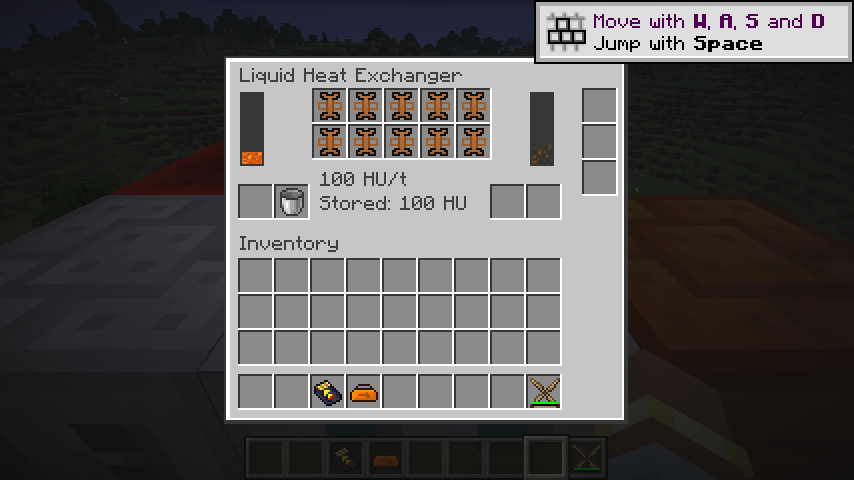
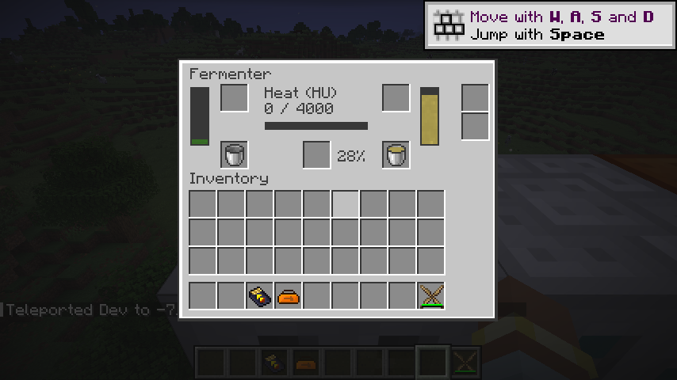

# 流体换热器

`ic2:liquid_heat_exchanger` 通过冷却热流体从正面输出 HU。输入／输出槽各 2,000 mB，十个导热元件槽各限一件 `ic2:heat_conductor`，每件提供 10 HU/t 带宽。两组流体容器槽保留顶部排空、底部充装及独立返回槽，三个升级槽仅接受物品／流体传输升级。

默认数据包 `ic2:cooling` 配方将 1 mB 岩浆转换为等量熔岩岩浆（`ic2:pahoehoe_lava`）、或 1 mB 热冷却液转换为等量冷却液，每 mB 产生 20 HU。热量由正整数 `heat` 配置，输入和输出为单 mB 的带组件流体模板。原先运行时注册的冷却规则现在可以通过数据包扩展和重载；升温规则留给后续热交换消费机器。

核心 `HeatExchange.plan` 同时考虑热流体数量、冷却产物槽空间和 HU 缓冲空间，以整 mB 结算。默认 20 HU/mB 需要至少两件导热元件，保留旧版整 mB 行为；一件元件不足以完成一次转换。每批资源移动与热缓冲写入在同一个原生事务中提交，输出流体不匹配或空间不足时不会消耗输入。

恢复版在“冷却槽剩余容量小于热流体数量”的一个分支中，错误地按 `剩余容量 × 20` 抽取热流体。现在输出槽仅余 1 mB 时只转换 1 mB，得到 20 HU；对应核心和服务端回归测试锁定该边界。

`WorkBuffer` 保存已付 HU 以及同刻抽取额度。移除元件会降低带宽，未用热量保留；反复取能力引用或重载不能重置同刻额度，事务回滚恢复热量。客户端仅通过原生完整 32 位菜单数据观察流体、储热和带宽，安装槽和扩展高度由服务端菜单统一定义。十件导热元件可一次 Shift 分配到十个单件槽。

发酵机与换热器共用流体配方契约、原生容器访问及组合流体权限视图；电热、电动动能与换热器共用菜单安装元件逻辑，避免重复维护单件槽与 Shift 行为。原生传输升级继续使用统一端口权限。

验证覆盖整 mB 取整、三重容量限制、大整数、输出只余 1 mB、元件安装与数量、错误物品、取热事务、移除元件后重载、实时转向、流体桶交换、端口权限、升级适用性以及自定义数据包。真实链路将 128 mB 热冷却液转换为 128 mB 冷却液、2,560 HU，经斯特林发电机和电网得到 1,280 EU。

热冷却液的反应堆来源、锅炉、蒸汽动能及后续热力机器仍需完成对应工作包；当前机器不代表 P10 全部完成。

2026-09-08：79 项核心测试、IC2／GT 两种模式各 109 项原生 GameTest 全部通过；产物检查覆盖 261 个 Java 25 类、284 个物品定义及 531 个模型依赖，520 条旧 JSON 配方已转换。真实客户端一次 Shift 安装十件导热元件、排空岩浆桶并显示 100 HU/t；相邻发酵机消耗换热器 HU 继续产气，沼气输出满后停止取热，换热器保留 100 HU。客户端没有缺失模型警告。

