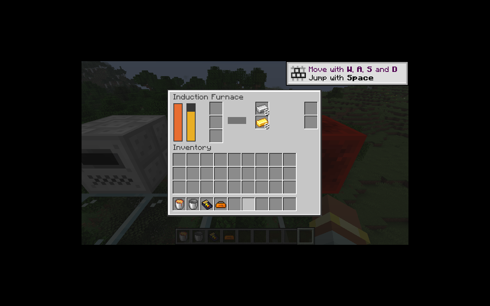

# 感应炉

感应炉保留两个输入／输出配对、共享温度和加工进度、10,000 EU 缓冲及 MV 128 V 输入。两路熔炼同时进行时只支付一次共享加工费用，一路阻塞不妨碍另一路完成；两路物品始终进入各自的输出槽。

核心 `InductionCycle` 每次预热消耗 1 EU、加工消耗 15 EU，进度增加 `heat / 30`，达到 4,000 后在下一刻提交产物。最高温度 10,000；空闲每刻冷却 4，红石可持续预热。修正恢复代码低电量时的一处边界：加工费用不足时不会推进工作。

批次完成把两路输入、产物和进度纳入同一事务。温度、待完成进度、EU 与经验均保存；高温双路加工核对为 13 刻共 208 EU，下一刻只结算一次。比较器输出随温度从 0 到 15。

保留两个升级槽，当前仅接受物品拉取／弹出；不接受超频、电压或储能升级。升级数量来自机器规格，菜单与 Shift 点击共用该数量。输入 A 无法接收时 Shift 点击会尝试输入 B。`HeatedMachineScreen` 与离心机共用热量显示。

启停与中断音由服务器状态转换触发，持续运转音由客户端按方块活动状态管理；区块加载不会重复播放启动提示音。

验证：49 项核心 JUnit；IC2／GT 各 71 项 GameTest（70 项 IC2 + 1 项原版）。新增覆盖冷机耗电、低电量禁止免费进度、满温批次边界、双路保存重载、单路阻塞及准确的槽位／升级限制。

P09 的机器主体已覆盖金属成型、洗矿、离心、回收与感应炉；离心机生存合成、核材料、铁栅栏、完整升级种类和多人整体验收仍待完成。

客户端已将两组各 8 件粗铁／粗金通过 Shift 点击送入不同输入槽，得到各 8 件铁锭／金锭；输出、热量和两个升级槽显示正常。测试使用调试电量与初始满温，音频在无声设备下仅检查事件／资源加载。

