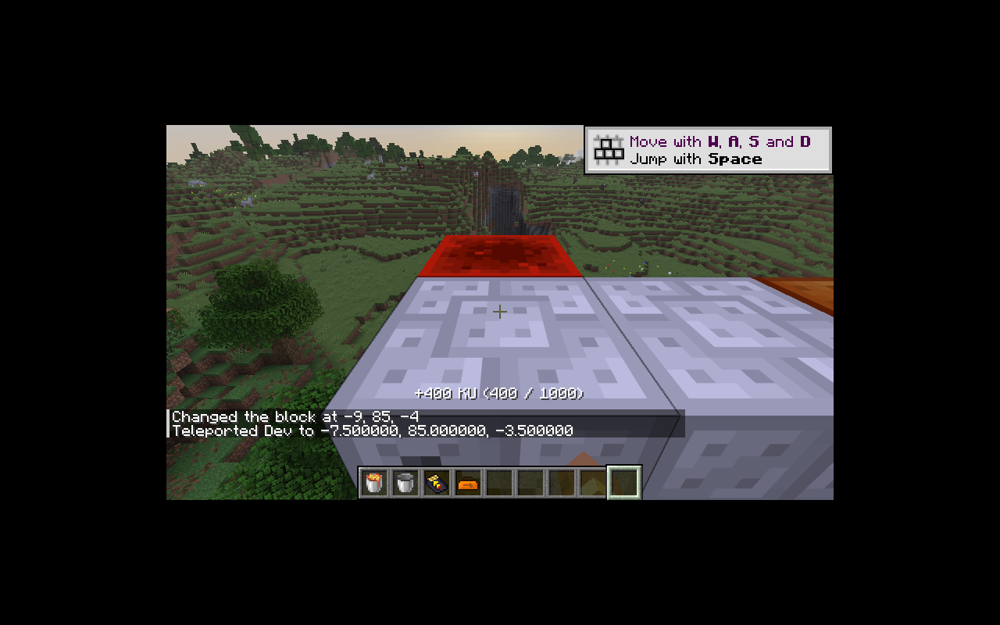

# 手动动能机

右键转动手柄，真人基础产生 400 KU，NeoForge `FakePlayer` 基础产生 20 KU。储量上限 1,000 KU；每台机器在一个世界刻最多接受十次操作，所有玩家共享限制。饥饿值必须大于 6，每次有效操作消耗 0.25 饥饿消耗值。保留满储量时仍计入操作并消耗体力的规则。

`ManualDrive` 核心只处理数量、限制和饥饿条件；平台层负责真实右键、玩家距离、原生饥饿系统和反馈。不打开库存菜单。真人可看到本次增加量和当前 KU，模拟玩家不发送界面提示。

手动动能机保留六面和无方向查询均可抽取的能力，所有视图共享同一储量、同刻带宽和事务回滚。KU、已用输出预算、点击刻与点击计数都保存，防止重载清空能量或重置点击限制。空闲时不执行额外计算，预算按世界时间惰性重置。

`manualKineticMultiplier` 支持小数倍率，按实际产量取整；修正旧版先把倍率取整导致 0.5 倍仍输出全量的问题。零倍率禁用操作且不消耗体力，默认倍率保持原产能。

验证：纯 Java 真人／模拟玩家产能、容量、每刻限制、重载、饥饿及倍率；原生方块右键验证十次模拟操作得到 200 KU 和 2.5 饥饿消耗值，不打开菜单；方向共享、事务回滚、重载与距离检查；实际手动 KU → 动能发电机 → MFE 链路验证持续电包。

P10 继续进行：带转子的自然动能源、蒸汽及其余热力设备待迁移。

本切片通过 65 项核心 JUnit，IC2／GT 各 91 项 GameTest（90 项 IC2 + 1 项原版）。两种模式均验证通过动能发电机向 MFE 输送至少 1,024 EU。配方账本为 511 条已转换、285 条待迁移。

真人客户端右键一次显示增加 400 KU，随后读取方块存档确认为 `kinetic: 400.0`，未打开菜单。

