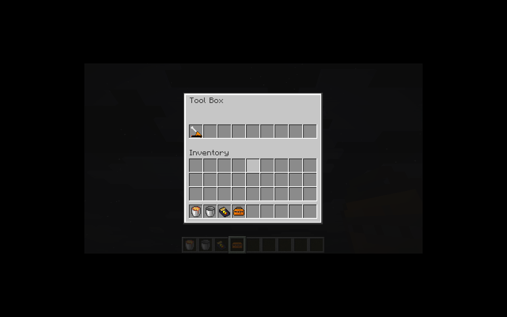
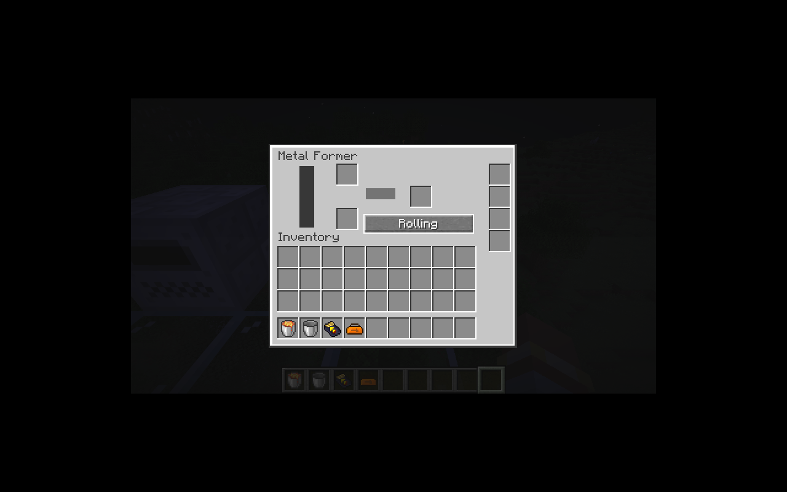

# 金属成型机与工具箱

金属成型机保持旧三个模式：挤压、辊压、切割；默认挤压。基础操作 200 刻、10 EU/t，带四个升级槽，默认实际缓冲 4,000 EU。28 条加工配方已迁移；铁外壳挤压铁栅栏尚待铁栅栏／磁化器联动实现。

`ProcessingMethod` 将配方族与方块种类解耦。`MetalFormerBlockEntity` 仅负责模式，充放电、升级、自动化、原子输入输出和加权产出复用基础加工实现。切换模式清空当前工作及已选产出，不返还已经消耗的 EU；保存重载保留模式和进度。按钮走原生容器权限校验。

工具箱使用原生 `ItemContainerContents` 组件与 `ItemAccessItemHandler`，九格内容随每次事务直接写回物品；丢弃、换物品或关闭菜单不依赖额外的延迟保存。`ic2:toolbox_tools` 标签允许已迁移的六种工具；禁止嵌套工具箱。耐久和电量组件保持原值。

打开时绑定背包槽位和物品 UUID，锁定工具箱本体的取出与主／副手数字键交换。旧菜单和旧能力句柄不能访问替换后的工具箱。只有空工具箱能参与金属成型机合成，避免合成吞掉工具。模型通过原生 range dispatch 显示打开／关闭状态。

界面外框和槽位绘制提取到 `ContainerScreenBase`，机器和手持容器共用，坐标来自菜单。

验证：43 项核心 JUnit；IC2／GT 两种模式各 57 项 GameTest（56 项 IC2 + 1 项原版）。新增回归覆盖三模式产出及精确 EU、处理中切换／重载、事务回滚、内容持久化与网络编解码、移入移出、主副手锁定、失效句柄及非空箱合成拒绝。

P09 仍在进行：洗矿、离心、回收和感应炉尚未迁移。P16 的其余工具与装备继续按工作包推进。

实际客户端验证：Shift 点击存入电动扳手，保存退出并重新进入后仍在工具箱内；工具箱开合模型正常。金属成型机按钮能从挤压切换到辊压。

