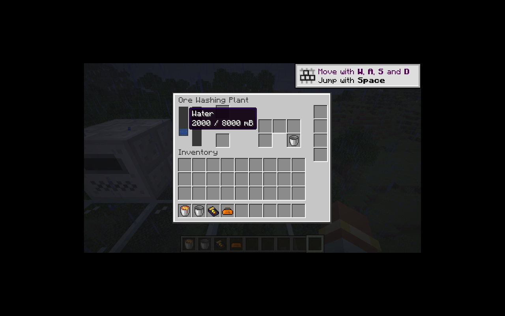

# 洗矿机与多输出加工

洗矿机保留 `ic2:ore_washing_plant` 方块及 `ic2:ore_washer` 配方 ID。八条旧配方全部转换，包括七类粉碎矿石和单产物的砂砾配方。基础 500 刻、16 EU/t，实际初始储能 16,000 EU，水箱 8,000 mB，每次默认配方消耗 1,000 mB。

`ProcessingBlockEntity.Job` 现在保存不可变产物列表；模拟与完成都使用原生堆叠插入。任一副产物放不下即整体回滚。原料、水、最后一刻 EU 和进度在同一事务中提交；基础机器仍使用单产物构造器。额外资源消耗与完成后的环境更新通过小型受保护方法扩展。

洗矿机有三个加工输出槽、独立的水容器输入和空容器输出。容器转移使用 ItemAccess 事务；空容器槽阻塞时不会抽走桶中的水。外部只能向水箱注水，无法抽取。`FluidMachine` 统一罐装机、流体发电机和洗矿机的侧面流体接口；流体拉取升级复用该接口，洗矿机不接受无意义的流体弹出升级。

加工进度、水和库存均保存；缺水时保持旧版无法开始工作的行为。升级额外操作同样逐次消耗水。界面新增三输出及容器槽，并共用原生流体显示组件。

验证：43 项核心 JUnit；IC2／GT 各 61 项 GameTest（60 项 IC2 + 1 项原版）。`WashingTests` 验证缺水不耗电、最后一刻副产物阻塞、保存重载后恰好完成一次、水桶输出阻塞回滚、侧面权限、定向流体拉取及配方持久／网络编解码。现有单输出机器测试同时回归通过。

P09 继续进行：离心机、回收机、感应炉与铁栅栏／磁化器尚待迁移。

客户端验证：手持水桶直接注入 1,000 mB；Shift 点击第二个水桶进入容器槽后自动回收空桶，水箱显示 2,000 / 8,000 mB。三输出和容器槽无重叠，流体提示正常。

