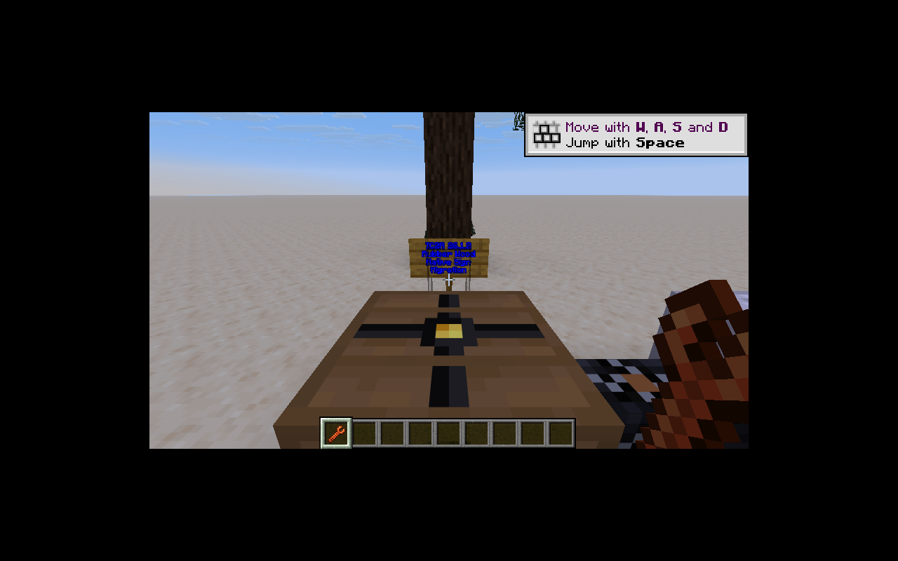

# 橡胶木建筑部件

保留 10 个旧方块 ID：按钮、门、栅栏、栅栏门、压力板、台阶、楼梯、活板门、立式及墙式告示牌；对应 9 种物品和 9 条配方。

`ModRubberBuilding` 集中注册原生方块，使用原生形状、水含量、放置、红石和门交互。补齐木质方块标签以支持原版栅栏连接及工具行为。橡胶按钮保持旧版 30 刻脉冲、不能用箭触发，使用独立 BlockSetType 表达差异。

恢复基线的双层台阶掉落表只返回一个台阶，门掉落表未区分上下半部；此次修复为双层返回两个、门只从下半部返回一个。

告示牌保留 `ic2:sign` 方块实体 ID，继承原生文字、编辑权限、上蜡、染色与发光处理；仅覆写实体类型、Ticker 和 Codec，不复制原生编辑协议。客户端使用 StandingSignRenderer 和独立 `ic2:rubber` 木材纹理。

`BuildingTests` 验证按钮持续时间、跨木种栅栏连接、门上下联动及单次掉落、双层台阶掉落、墙牌掉落、两面文字／颜色／发光／蜡持久化。完整运行每种电网模式 45 项 GameTest（44 项 IC2 + 1 项原版）。

客户端实际放置的告示牌可见自定义纹理与蓝色发光文字，未出现模组模型或材质加载错误。

建筑部件工作包完成；船只、装备和作物分别由其他工作包继续迁移。
