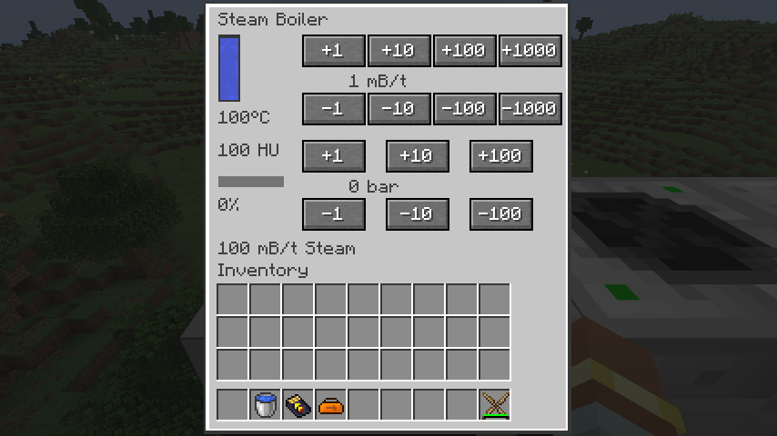
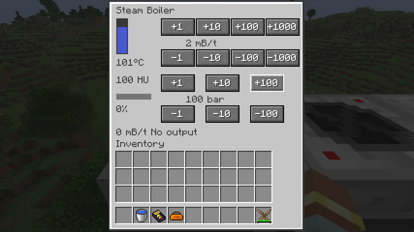
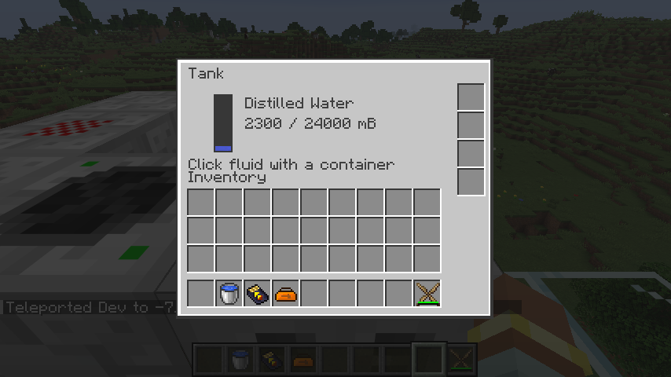

# 蒸汽发生器

`ic2:steam_generator` 迁入 10,000 mB 水槽、0–1,000 mB/t 进水限制、0–300 bar 压力阀、温度和结垢状态。它没有物品槽，也不直接用 EU；从六个相邻原生 HU 能力合计提取至多 1,200 HU/t。输入接受普通水和蒸馏水，禁止直接抽取；输出直接分配给相邻流体端口，不假设只能连接 IC2 机器，也不加载未加载区块。

核心 `SteamBoiler` 用不可变设置、状态和计算结果表达一刻的过程。默认环境温度按热／冷群系标签取 45／0°C，其余 25°C。每 HU 升温 0.0005°C，停机每刻冷却 0.01°C，最低为环境温度；压力决定目标温度 `100 + pressure / 220 × 274` 和每 mB 水的热耗 `100 + pressure / 220 × 100`。0 bar、100°C 时 100 HU 将 1 mB 水变成 100 mB 蒸汽；220 bar、374°C 时需要 200 HU，产出 100 mB 过热蒸汽。

保留恢复版的重要行为：零压尚未烧开时可以转发未沸腾的原料水，仅扣邻机实际接收量；有压力时先保留原料升温。高于目标温度时可以使用机体热量，但总汽化热预算仍不超过 1,200 HU；过热机体另可用最多 20 mB/t 水冷却，最多降温 2°C。蒸馏水不结垢，普通水按本次汽化／冷却尝试用量增加结垢，达到 100,000 后停止取热和用水。

输出受阻时，保留 10% 热泄压事件与其余情形下按完整 100 mB 蒸汽退回 1 mB 水的规则；不足一个水单位的余汽排放，已经消耗的 HU 不退还。结垢仍按恢复版的本次处理量计算，包括随后退回的水。菜单显示实际交付量，避免把被拒收的蒸汽显示为产出。泄压随机选择由世界种子、坐标和世界刻确定，同刻重载不能重新抽签。

源端取热、目标流体插入、原料扣除和机器状态用同一个原生事务提交。每个世界刻只处理一次，最后处理刻写入存档；重新打开菜单、保存替换方块实体不会重置额度。升温越过 500°C 时，在事务结束后触发强度 10 的[热爆炸](heat-explosions.md)；保护事件可以取消，温度保持有界。泄压事件使用强度 1。完整普通／核爆与反应堆系统仍继续迁移。

菜单公开十四个明确操作 ID，流量与压力独立限幅，拒绝未知请求以及关闭菜单后的请求。公共菜单族字段由五个扩为七个，容量字段按常量布局定位，所有值仍分为两个原生 16 位字同步；测试共用真实菜单包 Codec，覆盖温度位表示、输出量／类型和旧冷凝器的大容量字段。

原生测试覆盖冷机部分转发、端口限制、两个真实电热源产生过热蒸汽、普通水结垢停机、过热取消、同刻保存重载、部分蒸汽交付、阀门权限，以及 MFE → 电热源 → 蒸汽发生器 → 冷凝器的 100 mB 蒸馏水往返闭环。闭环中途替换锅炉实体；供热预算包含汽化和启动补温，不能只按理想的 10,000 HU 汽化热计算。

本切片接通了蒸汽生产和冷凝；后续[蒸汽动能发电机](steam-turbine.md)已验证双级做功与完整水循环，再压缩机仍待迁移。热力学初始温度由测试夹具设置，真实冷启动取热已经独立验证。

2026-09-08：90 项核心测试通过，IC2／GT 各 136 项原生 GameTest 全部通过；产物检查覆盖 294 个 Java 25 类、290 个物品定义和 546 个模型依赖，526 条旧 JSON 配方已转换。真实客户端确认 100 HU/t → 100 mB/t 蒸汽、流量／压力阀的独立操作和升压补温，末端储罐收到 2,300 mB 蒸馏水。

