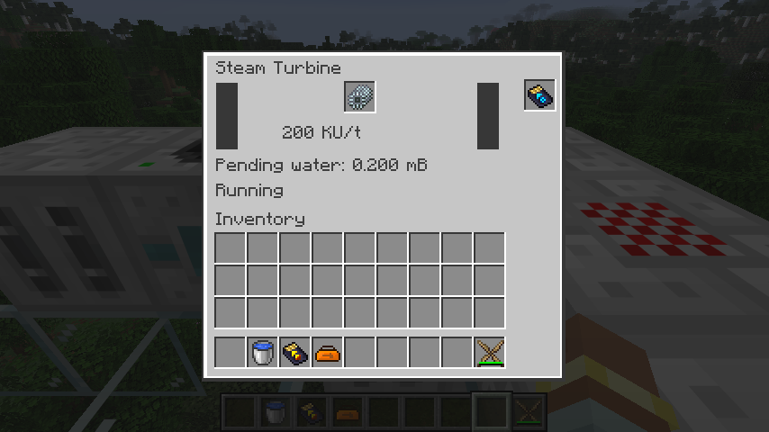
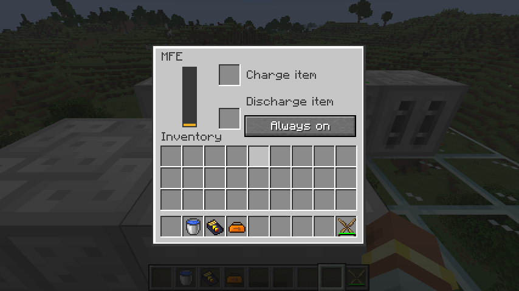

# 蒸汽动能发电机

`ic2:steam_kinetic_generator` 接入 21,000 mB 蒸汽槽、1,000 mB 冷凝水槽、一个汽轮机安装槽和一个升级槽。使用平台无关的 `SteamTurbineCycle` 计算过程，再用原生事务同时提交流体和已支付的动能；正面提供 KU，动能发电机将其转换为 EU。

普通蒸汽每 mB 产生 2 KU，过热蒸汽产生 4 KU，乘以服务器配置倍率和 `1 - 水槽量 / 1000`。每刻处理可用的一批蒸汽；水槽满、没有汽轮机或倍率为零时保留原料。过热级将等量普通蒸汽交给相邻汽轮机或冷凝器；普通级仅向冷凝器排汽，防止普通蒸汽在多台汽轮机之间循环发电。普通级按每批 `floor(蒸汽 / 10)` 记入冷凝额度，剩余排汽；不能交付的排汽排放，并保留恢复版的 10% 热泄压事件。

每 100 个冷凝额度换取 1 mB 蒸馏水，保留每刻最多 1 mB 的速率。额度使用有界 long 保存，大批蒸汽不会因整数溢出丢失记账；槽内存在不兼容液体时暂停需要凝水的生产。已凝结的额度在没有新蒸汽、移除汽轮机或关闭转换倍率之后仍能完成出水，这修复了旧实现把余量永久留在机器内的情况。

动能使用有限的 `WorkBuffer` 批次：实际消耗蒸汽后发布新批次，提取按请求量扣除，并保留同刻已领取总量。新批次替换未使用的旧批次，不能积攒无限输出。恢复版动能接口忽略请求量且不扣余额；迁移后即使消费者先于生产者执行、旋转方向、回滚事务或同刻保存重载，也不能重复获得已消耗的 KU。产汽、凝水额度、剩余 KU 和处理刻均保存；这不代表已支持 Forge 旧世界直接升级。

汽轮机物品沿用恢复版的普通非耐久物品。旧代码虽尝试磨损，但注册物品不具备耐久，实际无效；此次没有新增耐久规则。安装槽严格限制一个，顶部自动插入，禁止抽取有效汽轮机；支持物品拉入、流体拉入和流体弹出升级。水槽可从外部注入普通水或蒸馏水，也可抽取；输入蒸汽禁止外部抽取。界面显示 KU/t、待凝水量和缺件、满水、排汽、降速等状态。

原生 GameTest 覆盖消费者先执行、按请求限额、事务回滚、同刻替换方块实体、实时旋转和移除部件、冷凝余量重载、满水降速、槽位与端口权限、零倍率保留原料，以及完整双级闭环。双级夹具由 MFE 和两台电热源向 220 bar 锅炉供热，过热级与普通级分别连接动能发电机和独立 MFE；1,000 mB 蒸馏水最终分为普通级 100 mB 和冷凝器 900 mB。测试中途替换普通级实体，并核对能量上限。初始锅炉温度由夹具设置，冷启动已由锅炉测试独立验证。

2026-09-08：94 项核心测试、IC2／GT 各 142 项原生 GameTest 通过。产物检查覆盖 301 个 Java 25 类、291 个物品定义、549 个模型依赖，527 条旧 JSON 配方已转换。真实客户端确认普通蒸汽输出 200 KU/t，末端独立 MFE 已收到 110,600 EU，汽轮机和冷凝器凝水均进入各自储罐；界面读数、安装槽、运行状态和模型正常。多人交互与断线重连仍归 M16 验收；本功能随 P10 继续推进，不将整个热力机器族标为完成。

