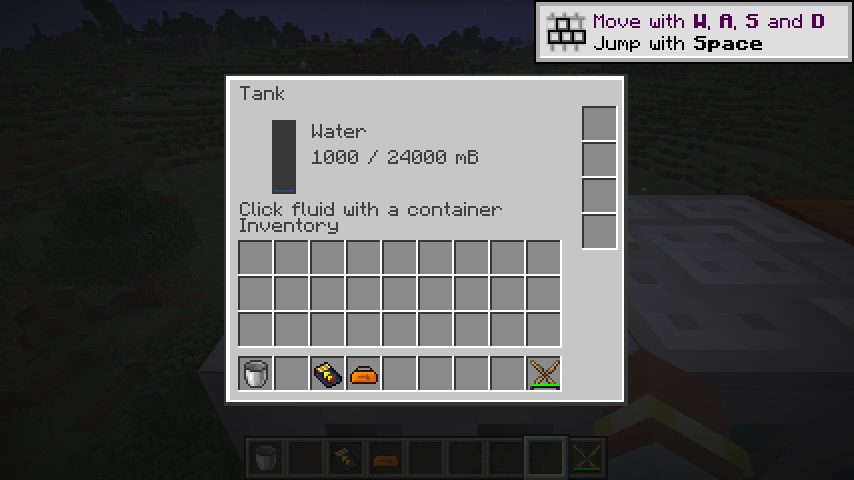

# 储液罐

`ic2:tank` 保存最多 24,000 mB 单种流体及其数据组件，所有面均支持原生事务注入和抽取。四个库存槽仅接受流体拉取／弹出升级；物品自动化无法替换已安装升级。比较器空罐为 0，非空为 `1 + floor(14 × 储量 / 24000)`，满罐为 15；事务提交后的信号变化通知相邻比较器。

方块右键使用共用原生流体交互，可持桶注入或抽取。菜单保持旧版光标容器操作：把容器拿在光标上点击流体显示，普通点击处理一件，Shift 点击最多处理初始堆叠中的 64 件。优先将罐内流体装入容器，否则尝试排空容器。整次批量操作固定传输方向，避免原光标耗尽后把刚装满的容器倒回储罐。

容器、光标、玩家库存和罐内流体均使用 NeoForge 原生事务访问。容量不足以接收整桶时没有部分扣除。服务端要求请求来自玩家当前菜单、仍在交互距离内且目标仍是原方块实体；未知操作 ID、关闭菜单后的请求和目标被移除后的请求被拒绝。

NBT 保存完整流体及升级组件。界面通过已有完整 32 位菜单数据读取流体类型和数量，世界模型保留旧资源。核心容量和合并规则直接复用原生容器，不再建立并行流体实现。

原生 GameTest 覆盖容量、禁止混液、所有侧面、半满和满罐比较器、事务回滚、存档重载、普通和批量光标桶转换、未知／远距离／关闭／失效目标请求、剩余 500 mB 空间时整桶回滚，以及定向升级转移后的总流体守恒。

储罐属于 P08 存储辅助机器切片，为电解机的上下气体输出提供真实目标。P08 的箱子、充电站、分拣、交易、个人保护、传送与磁化仍待迁移。

2026-09-08：79 项核心测试、IC2／GT 两种模式各 112 项原生 GameTest 通过；产物检查覆盖 263 个 Java 25 类、285 个物品定义和 533 个模型依赖，521 条旧 JSON 配方已转换。真实客户端将水桶拿到光标后点击流体条，确认水桶变为空桶且储液量显示为 1,000 / 24,000 mB；四个升级槽和界面布局正常，无缺失模型警告。

