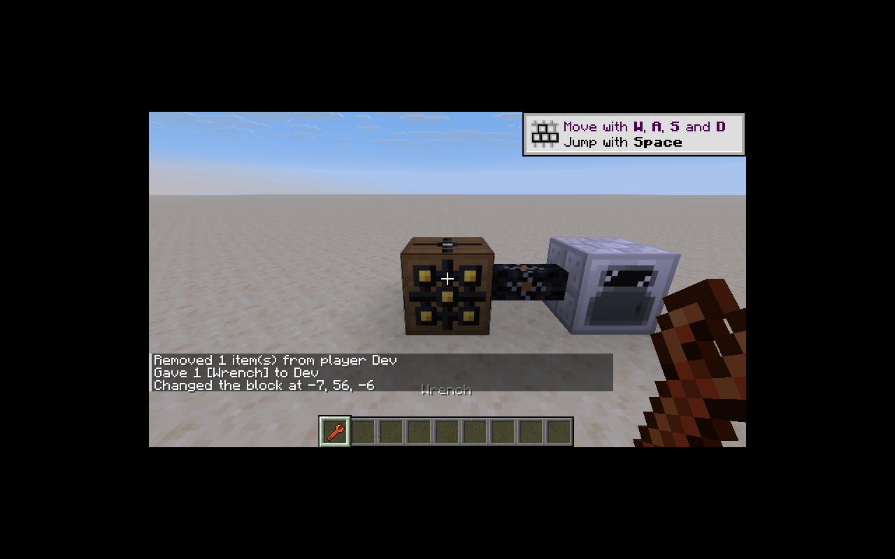

# 工具与拆装

已接入扳手、电动扳手、锻造锤和切线钳。模型沿用旧资源；挖掘行为接入原生 Tool 数据组件与普通生存破坏流程。

- 扳手：120 耐久，目标方块挖掘速度 6。右键按命中区域旋转，中心为当前面、边缘为相邻面、角落为背面；储能与变压器可朝六面，水平机器拒绝上下朝向。
- 电动扳手：12,000 EU，250 EU 物品传输上限，等级 1，挖掘一次消耗 100 EU。旋转不消耗电量，保持旧行为。
- 锻造锤：80 耐久；切线钳：60 耐久。IC2 无序合成按每次一耐久返回工具，最后一次不返还；合成预览不修改输入堆栈。
- 切线钳右键以一份橡胶加一层绝缘，消耗一次耐久；左键剥一层绝缘，消耗三次耐久并返还一份橡胶。最大绝缘层数由已有导线规格决定，无可用变体时不消耗材料。

正常掉落从旧 `Ic2Blocks` 声明生成。原本只掉外壳的机器，普通工具仍掉外壳，匹配 `ic2:wrenches` 标签时掉机器本体。储能设备掉本体时将 `stored_energy` 数据组件写入掉落物，重新放置恢复电量；保留比例使用服务器 `energy.storageDropRetention`，默认 0.8。

拆卸通过 Minecraft 和 NeoForge 的原生破坏流程，因此保护模组取消 `BreakBlockEvent` 时不会丢机器、耗耐久或扣电。没有另设绕过原生破坏事件的删除路径。

`ToolTests` 实测普通镐拆 MFSU 得高级外壳；100 EU 电动扳手拆满电 MFSU 得 32,000,000 EU 本体，电量归零，库存只掉一次，重新放置恢复储能。另测被取消的拆卸、旋转边界、绝缘材料与耐久守恒、合成工具的最后一次使用。
`ConsumptionTests` 补测罐头按饥饿缺口进食、空罐返还及满背包回滚。

38 项核心单测以及 IC2／GT 各 36 项 IC2 GameTest 加 1 项原版测试通过。客户端实测手持扳手右键旋转了朝西的 LV 变压器，命令校验其已朝北，模型正常且未误开机器菜单。

剩余工作：扳手的面选择叠层、工具箱与其他工具装备整合，客户端持续及多人验收。工具清单仍保留部分实现状态。
