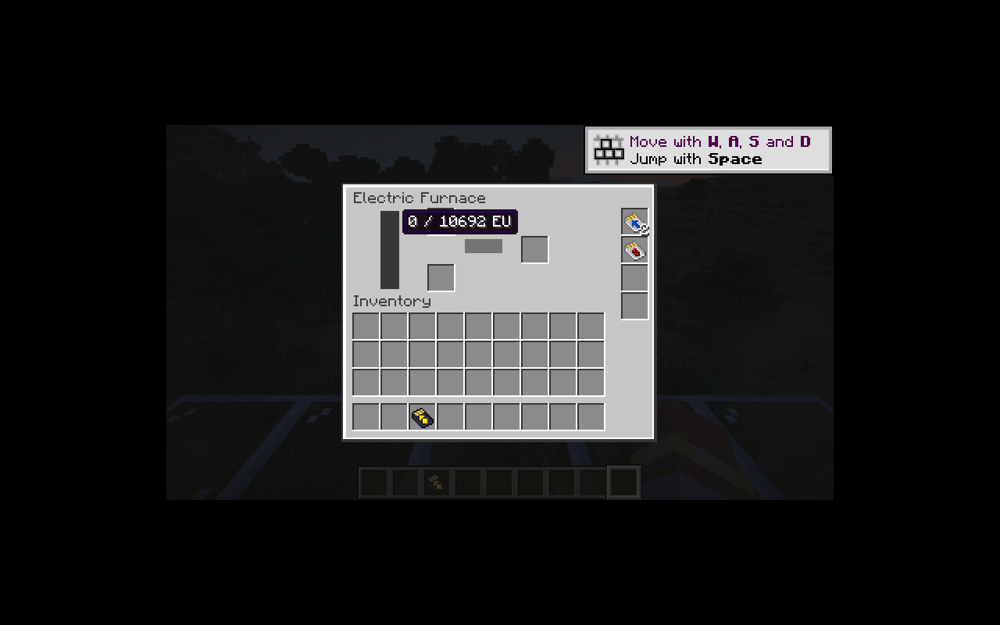
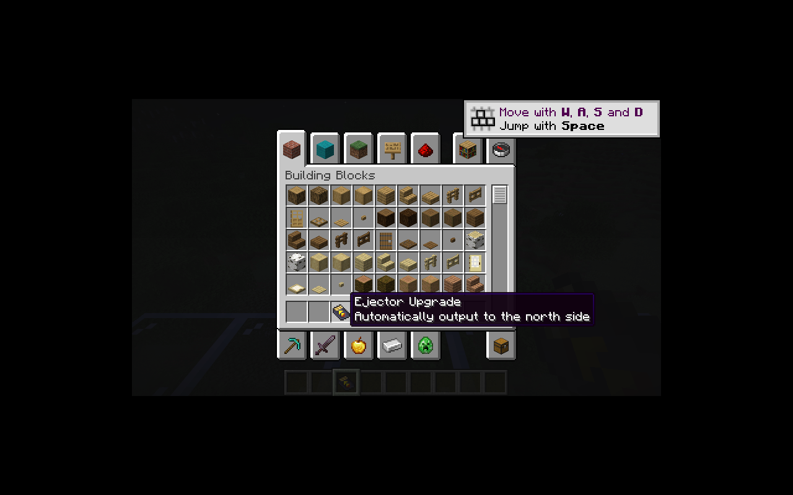

# 机器升级

电炉、打粉机、提取机、压缩机与罐装机增加四个升级槽，继续使用原生菜单槽位同步。新增七种升级：超频、变压、储能、物品弹出／抽入、流体弹出／抽入。流体升级仅允许放入有流体接口的罐装机。

`UpgradeProfile` 在独立 core 中计算旧版 0.7 时间倍率、1.6 能耗倍率、10,000 EU 储能加成与变压等级。保留不足一刻时的批量加工规则，每个加工刻消耗一次配置能耗；一次额外处理最多遍历 64 份输入，对应现有机器的输入堆叠上限。极端堆叠先以宽数值计算再饱和，避免整数乘法溢出。

修正第一阶段迁移遗漏的旧版容量规则：基础容量还要加一轮加工的能量缓冲，因此无升级电炉实际容量为 600 EU，基础加工机为 1,200 EU，罐装机为 1,600 EU。菜单新增两个 16 位字段同步实际容量。

装卸升级按处理比例缩放进度；加载存档时先读取升级、调整容量，再恢复 EU，避免升级储能被基础容量截断。移除储能升级时只丢弃超过新容量的能量。输入电压／电流变化会使世界电网重新计算。

自动进出共用机器向外暴露的侧面接口，使用 NeoForge 原生事务传输。方向保存在 `ic2:upgrade_direction` 数据组件中，点击方块表面配置该方向，再次点同方向恢复所有方向。图标根据该组件切换方向贴图，界面和提示不读取旧 NBT。

每个升级堆叠每侧每刻最多传输 `4^min(4, count-1)` 个物品或其 50 倍 mB 流体；只访问已加载区块。自动化不能改动升级槽。加工输入按实际配方筛选，罐装机分别筛选容器／添加剂；原料堆叠不足一轮时仍可逐个输入。

新增核心测试覆盖常用倍率、256 个升级的数值边界和容量收缩；GameTest 覆盖进度比例、升级储能重载、批量产出与满输出暂停、动态菜单、定向箱子传输、跳过无效原料和满流体槽回滚。

本地 41 项核心 JUnit、IC2／GT 两种模式各 49 项 GameTest（48 项 IC2 + 1 项原版）通过。客户端 Shift 点击可装入升级；两个超频加一个储能升级显示实际容量 10,692 EU。

客户端点击北侧后，弹出升级的图标和提示均切换为北侧。

剩余：高级弹出／抽入的过滤菜单，红石反相与远程接口在适用机器上的行为，以及其余机器族的升级支持。P04 继续保持进行中。
