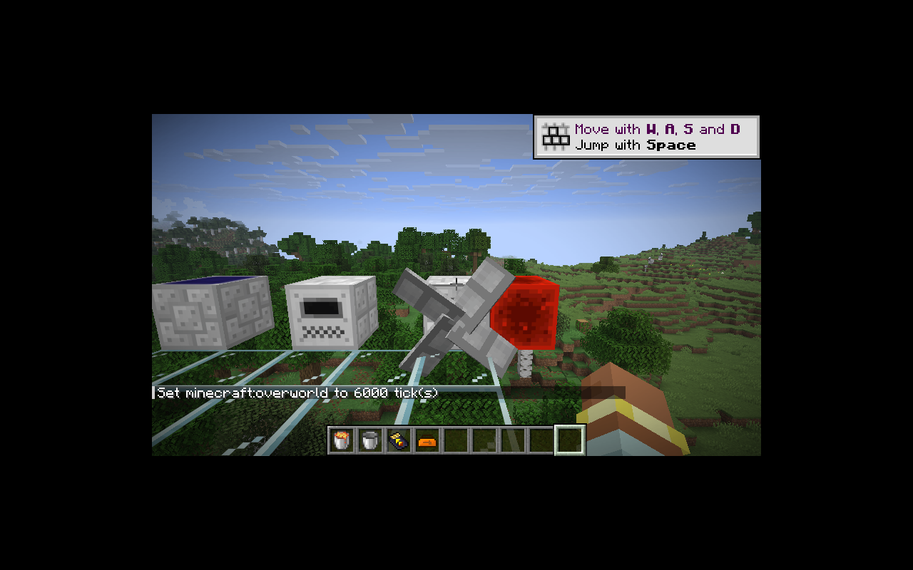

# 水力发电与转子

水力发电机保留周围 3×3×3 范围的水源采样、容器批次和旧转子模型。水块每 128 刻错开采样，首次加载立即计算；跨区块采样不主动加载相邻区块。

每个水源基础提供 0.01 EU/t。环境倍率从缓存的水块数量派生，避免旧代码反复把倍率乘回计数而产生指数增长。`ic2-generation-server.toml` 提供水力倍率和默认关闭的容器自动化。

一个水桶返回空桶到原槽位，提供 500 刻、1 EU/t；无合成返还物的水单元被整体消耗，提供 500 刻、2 EU/t。批次最多累计 2,000 刻。保留旧版满电仍消耗批次的行为，空桶占据燃料槽时不会自动切换环境供电。批次发电量一并持久化，修复水桶重载后错误恢复成 2 EU/t 的问题。

IC2 模式保留 4 EU 缓冲。GT 模式使用 32 EU，至少能积累一个完整 LV 电包；否则旧 4 EU 容量永远无法向网络输出。菜单同步实际容量。

`RotorRenderer` 使用新提取／提交接口，提交阶段只读取渲染状态。四叶模型与纹理来自恢复版本，动画按游戏时间、转速累计，暂停不转动；渲染范围覆盖整个转子。服务器仅在转速变化时发送观察者更新，菜单单独同步燃料和发电信息。

验证：52 项核心 JUnit；IC2／GT 各 75 项 GameTest（74 项 IC2 + 1 项原版）。覆盖桶和单元功率、批次重载、默认自动化限制、环境水源及转速、倍率稳定性，以及实际向相邻 BatBox 输出至少一个完整电包。

P06 保持进行中：同位素、热／动能转换及其余平衡配置继续迁移。

客户端验证：水桶进入原燃料槽后返回空桶，缓冲产生实际 EU。转子模型可见，连续截图中叶片角度变化；模型展示阶段使用调试燃料延长运行时间。

