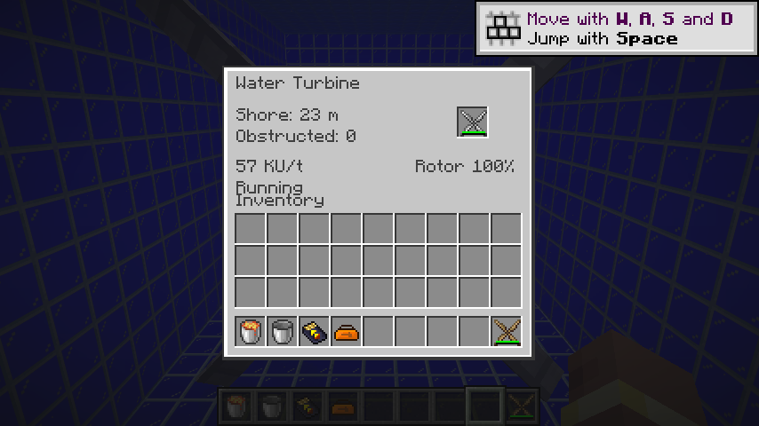
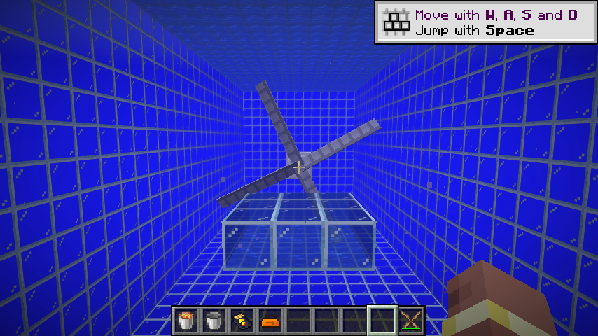

# 水力动能机

水力动能机使用与风力动能机共用的库存、每刻产能预算、原生事务能力、磨损和观察者同步。机器只接受青铜、铁、钢、碳纤维转子，原生自动化和菜单均拒绝木质转子。KU 从机器背面输出，通过动能发电机接入电网；未消费产能不累计，重复能力调用共享额度，回滚及重载不能重复提取同刻产能。

环境计算独立在无 Minecraft 依赖的 `WaterFlow`。每 20 刻按机器位置错开采样，使用原生河流、海洋、深海生物群系标签。河流转子直径缩为 `(原直径 + 1) × 2 / 3`；两种海洋使用完整直径。前方转子平面必须全部为原生水方块；水浸实体方块仍视为阻挡。沿轴向前后各三倍直径检查通道，同类水力动能机造成干扰。扫描只读取已加载区块，未知方块视为阻挡。

岸距为正反轴线上首个非水域生物群系的距离，最多 200 格。原生生物群系查询不请求生成区块，未加载位置回退到维度的生物群系生成源；已加载、经过命令编辑的生物群系可以被识别。岸距和类型随周期重新采样，因此改变群系无需重载机器。

| 水域 | 流速 | 基础流量系数 | 每 20 刻磨损 |
|---|---|---:|---:|
| 河流 | 岸距限制在 20–50 后除以 50 | 1,000，叠加 0–30% 扰动和线性遮挡 | 1 |
| 海洋 | 潮汐 × 岸距 / 100 × 平方遮挡衰减 | 3,000 | 2 |
| 深海 | 同上 | 4,000 | 3 |

潮汐为 `sin(维度默认时钟 × π / 6000) × abs(sin(...))`。保留流量计算各阶段的整数截断，最后乘转子效率、0.2 和 `waterKineticMultiplier` 得到非负 KU/t。退潮改变动画方向，输出仍为正值。有效水域内平潮继续产生旧版磨损；禁用倍率、阻挡、干扰或无效水域不磨损。

河流扰动通过世界种子、位置和固定采样时段生成，不推进全局随机数序列，也不会因重载或更换转子重新抽取同一时段的流量。海洋使用 26.1.2 默认世界时钟 API；没有默认时钟的维度潮汐停在零点。

## 有意修复的恢复版缺陷

- 深海同时属于普通海洋标签。先判断深海，恢复独立 4,000 流量和三点磨损分支；深海采用海洋完整直径。
- 旧 `getRotationSpeed` 计算岸距与遮挡后却返回未衰减的潮汐值。现在实际使用完整计算结果。
- 旧 `drawKineticEnergy` 只返回可提取值而未记录消费。现由共用 `WorkRate` 管理事务和每刻额度。

核心回归覆盖潮汐方向与周期、岸距、遮挡、深海功率和磨损、河流扰动范围、转子兼容及禁用配置。原生 GameTest 使用密封水道和受控群系／时钟环境，覆盖河流安装及重载、磨损、空间恢复、同类干扰、群系变化、深海与退潮、实际 KU → 动能发电机 → MFE 链路。测试环境结束恢复原时钟；测试代码和结构不进入生产 JAR。

多人竞争抽取及大量转子的性能验收仍由 M16 跟踪，P10 其余热力机器继续迁移。

2026-09-08：74 项核心测试、IC2／GT 两种模式各 98 项原生 GameTest 全部通过；产物检查覆盖 244 个 Java 25 类、282 个物品定义与 525 个模型依赖，518 条旧配方已转换。真实客户端在受控海洋水道中安装铁转子，显示岸距 23 米及动态 KU/t，确认水下材质、完整转子尺寸和界面；本轮启动日志没有缺失模型警告。无图形桌面环境仍产生系统朗读库和 X11 光标警告，与模组模型无关。

