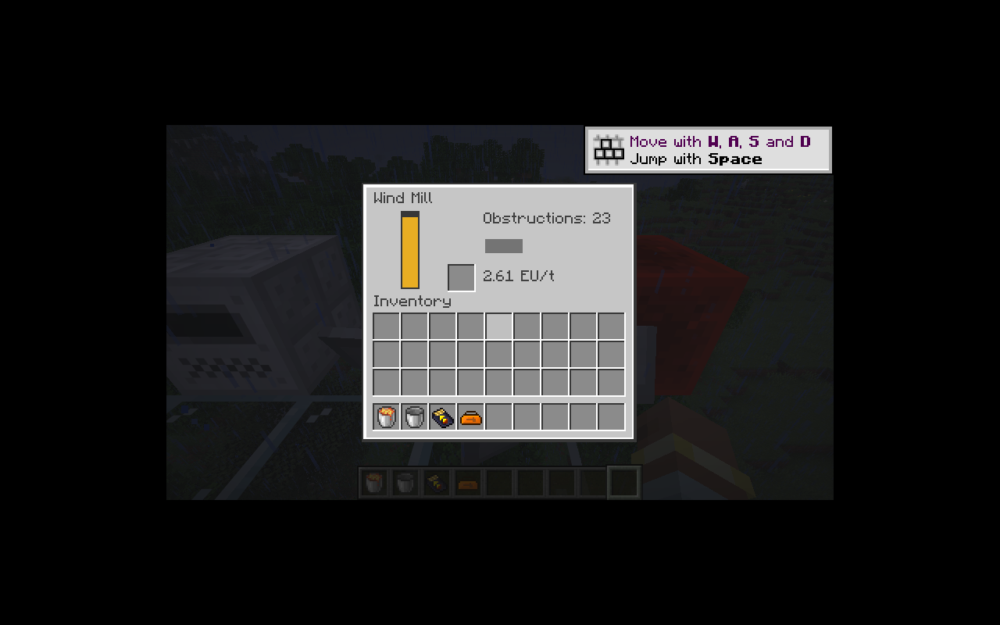

# 风力发电与世界风场

风场由不依赖游戏 API 的 `WindSimulation` 计算，平台层 `WorldWind` 使用原生 `SavedData` 管理每个维度的生命周期。风强、风向、128 刻更新相位及原生 `RandomSequence` 随世界保存，重启后继续同一随机序列；不消耗世界其他机器使用的随机数。旧版风向回绕的 359 修正为 360。

高度曲线保留旧版三次函数约束：海平面与维度高度跨度中点达到峰值，峰值导数为零，1.125 倍高度跨度处归零。这里采用维度高度跨度而非最高方块 Y，与恢复代码一致。雨天倍率 1.25、雷暴 1.5，基准最大风力 108。

发电机计算 9×7×9 范围内 566 个邻居的遮挡，每 1,024 刻更新；产能每 128 刻错开更新。首次加载立即采样，避免旧构造器默认产能在第一次采样前凭空发电。未加载相邻区块视为遮挡，不主动加载区块。

基础产能为有效风力的十分之一，由 `ic2-generation-server.toml` 的 `windMultiplier` 调节。IC2 缓冲保留 32 EU；GT 缓冲采用 `32 + ceil(10.8 × 倍率)`，默认 43 EU，容纳一个完整 LV 电包及一个发电步长，避免小数产能不能填满 32 EU 而停止输出。生成时仅在能容纳整步产能时入账。

恢复版在超速损坏判断前清零产能，因此永远不会损坏。`windBreakage` 默认关闭，保持该默认行为；开启后按实际产能恢复超速概率、普通方块掉落及 0–4 个额外铁锭。损坏后的机器停止该刻后续更新，避免活动状态更新重新放回已破坏方块。

风、水共用转子渲染和界面。风力界面显示遮挡数、EU/t 和超速负荷提示；旋转状态只发送给观察者，完整机器数据通过菜单同步。电池槽接受手动充电，不开放自动物品传输。

验证：55 项核心 JUnit；IC2／GT 各 78 项 GameTest（77 项 IC2 + 1 项原版）。新增覆盖曲线与天气、随机游走边界、360 度回绕、小数电量守恒、连续电包、原生 Codec 保存随机状态后 4,096 刻演化一致，以及真实高空结构中的遮挡和网络供电。超速损坏默认关闭；其概率掉落分支尚未单独进行客户端破坏测试。

P06 继续进行：同位素与热／动能转换、剩余配置和整体验收仍在迁移清单。

客户端实测：自然世界中风机显示 23 个遮挡和 2.61 EU/t，产生实际电量，转子可见。退出世界后，主世界、下界、末地均生成各自的 `data/ic2/wind.dat`。

## 第 61 轮审计(2026-09-12)

- 勘误翻 implemented 2 条:wooden_rotor、iron_rotor item。
- 依据:转子链(规格/耐久/风场与水域/空间/产能预算/重载/转电)经
  WindTurbineTests/WindGenerationTests/WaterTurbineTests/SteamTurbineTests
  直接覆盖(RotorMaterial.WOODEN/IRON 实例断言);
  原 note 留尾仅多人与性能实机项。
- 验证:IC2/GT 双模式 558×2 全绿;registry 1130/49/20→1157/22/20。
- 留人工:多人/性能实机(M16)。bronze/steel/carbon_rotor 无直接断言,留 partial
  待补 GameTest 切片(不虚报)。

## 第 62 轮交付(2026-09-12)

- 补 GameTest 功能切片 3 项:WindTurbineTests.bronzeRotorOperates/
  steelRotorOperates/carbonRotorOperates(注册名 turbine_rotor_bronze/
  steel/carbon),兑现第 61 轮"bronze/steel/carbon_rotor 留 partial 待补"
  的承诺。
- 断言:RotorOperation.wind(材质, 30, 0, 1) 落入各材质风窗
  (bronze[14,75]/steel[17,90]/carbon[20,110])→ status RUNNING、
  output>0、diameter==材质直径;装转子后 serverTick 重采样直径一致、
  maxDamage==材质耐久(86400/172800/604800)。
- 风场说明:GameTest 结构内实际采样风≈14,只够 wooden 窗口;高材质窗口
  语义断言在 core 公式层直接覆盖,机器链(装转子→重采样→直径/耐久)在
  BlockEntity 层覆盖,不虚构风值(WorldWind strength codec 上限 30)。
- 验证:IC2/GT 双模式 564×2 全绿;registry 1157/22/20→1163/16/20
  (bronze/steel/carbon_rotor 勘误翻 implemented)。
- 留人工:多人/性能实机(M16)。
