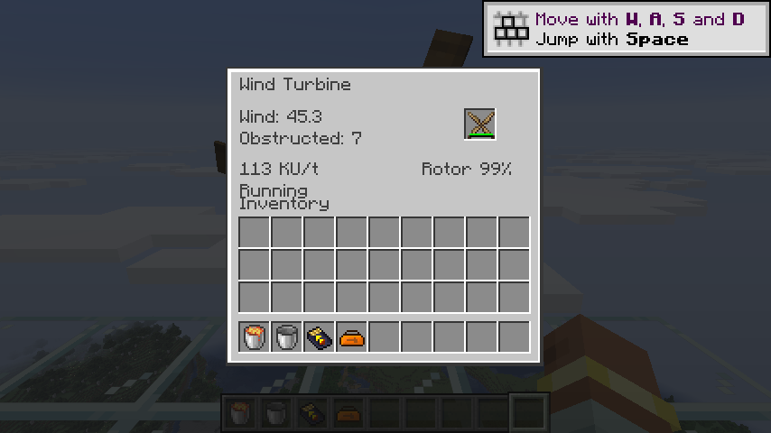
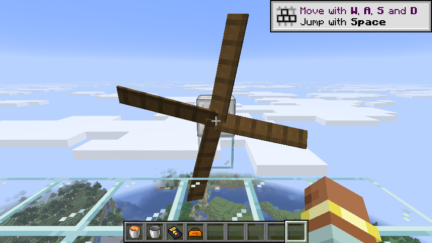
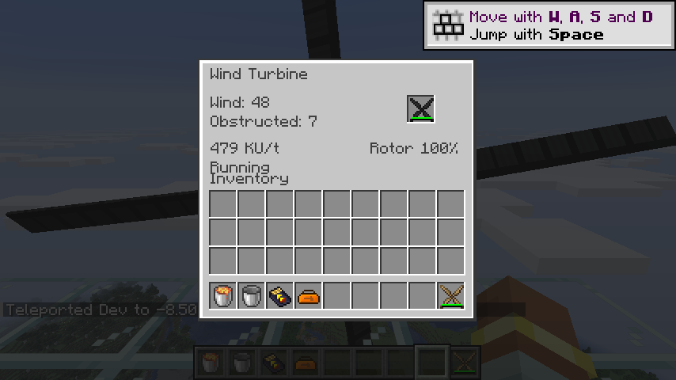
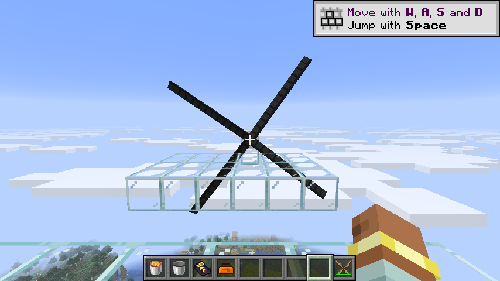

# 风力动能机与五种转子

风力动能机从背面输出 KU，使用独立的 `WorkRate` 每刻产能预算。未使用产能不累计，多次调用和不同能力引用共享预算，事务回滚恢复抽取额度。修复恢复版 `drawKineticEnergy` 只返回数值而不记录已抽取量的问题，防止多次请求重复取得同一刻产能。重载保留已抽取额度。

| 转子 | 直径 | 耐久 | 效率 | 风力范围 | 水力兼容 |
|---|---:|---:|---:|---|---|
| 木质 | 5 | 10,800 | 0.25 | 10–60 | 否 |
| 青铜 | 7 | 86,400 | 0.5 | 14–75 | 是 |
| 铁质 | 7 | 86,400 | 0.5 | 14–75 | 是 |
| 钢质 | 9 | 172,800 | 0.75 | 17–90 | 是 |
| 碳纤维 | 11 | 604,800 | 1 | 20–110 | 是 |

保留旧版前方转子平面的空间要求、沿轴向前后各三倍直径的阻力区域、平方遮挡衰减，以及薄支撑结构的容差。同类动能机在区域内会造成干扰。采样缓存本次访问的已加载区块，未知区域视为遮挡，不主动加载区块。只允许水平放置和扳手转向。

产能为有效风力 × 效率 × 10 × `windKineticMultiplier`，低于转子最低风力时停止输出。正常转动每 32 刻磨损一点，超过最高风力时磨损四点。采样与磨损按世界时间错开，保存上次磨损刻，防止重载复用同刻磨损或通过不断重载重置磨损时钟。零倍率停止产能和磨损。

五种转子使用原生物品耐久、单件槽、库存事务和 NeoForge 物品提示事件。渲染器共用于固定转子发电机和可更换转子的动能机，按直径缓存模型，提交阶段只读取已经提取的渲染状态。客户端仅接收材质、直径与角速度，库存和磨损由菜单同步；观察者更新不再清空客户端已有库存或能量。暂停时保留已采样时间，避免恢复时重复累计小数刻。

验证使用独立原生强风测试环境，测试结束后恢复原世界风场，避免随机初始风力造成偶发失败。覆盖空间堵塞与恢复、同类干扰、正常磨损、重载不重复产能或磨损、背面输出、事务回滚，以及真实风力 KU → 动能发电机 → MFE 链路。核心覆盖风力门槛、效率、超速磨损、平方遮挡、禁用配置和每刻产能预算。

水力兼容转子的使用见 [水力动能机](water-turbine.md)；多人／性能验收继续由 M16 跟踪。

2026-09-08 验证：70 项核心测试、IC2／GT 两种模式各 94 项服务端 GameTest 通过，517 条旧配方已转换。真实客户端通过 Shift 安装和更换木质／碳纤维转子，确认直径 5／11、对应材质及动态 KU 菜单。补齐旧水车和风车上下朝向模型变体，并在产物检查中验证所有机器的 12 种方块状态均有唯一模型。

