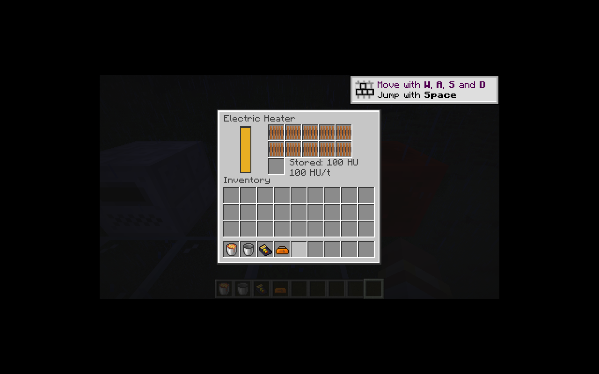
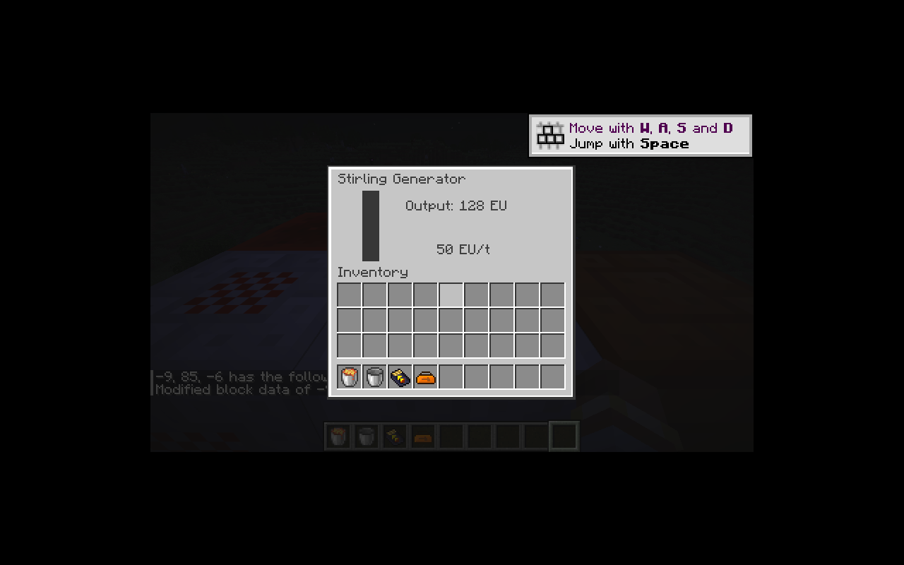

# 热能／动能接口与电力转换

新增电力加热器、电动动能机、斯特林发电机和动能发电机。热能与动能分别通过 `ic2:heat`、`ic2:kinetic` 原生方块能力传递，共用 `WorkSource` 的带宽、可用量和事务抽取约定。查询无副作用，消费者在同一个事务中抽取 HU/KU 并加入 EU；回滚同时恢复储量与当刻输出预算。

`WorkBuffer` 属于纯 Java 核心，记录储量、世界刻和该刻已抽取量。每个世界刻的所有请求共享带宽，即使当刻补充缓冲也不能再次突破上限。能力对象每次调用检查当前朝向及方块实体是否已移除，旋转后旧引用不能继续从错误方向抽取；消费者不加载相邻区块，也不持有可能过期的邻居实体。

| 设备 | 输入 | 输出与缓冲 |
|---|---|---|
| 电力加热器 | EV，10,000 EU；电池槽 | 每线圈 10 HU/t，最多 100 HU；默认 1 HU/EU |
| 电动动能机 | EV，10,000 EU；输出面不收 EU | 1,000 KU 缓冲，每电机 100 KU/t，默认 4 KU/EU |
| 斯特林发电机 | 正面相邻热源 | 默认 0.5 EU/HU；按带宽选电压 |
| 动能发电机 | 正面相邻动能源 | 默认 0.25 EU/KU；最高 HV、512 EU/t |

线圈和电机各有十个单件槽，底层库存和菜单均限制每槽一件，Shift 点击逐槽安装。两台电力输入设备保留手动电池管理，不开放物品自动化。四台设备都支持六面朝向，转换发电机正面不输出 EU。

转换发电机在两种电网模式下都使用有界 EU 缓冲，将旧 IC2 模式中的网络回调即时抽取改为显式机器步骤。容量容纳一个电包和一个转换单位，满电后停止抽取。电压由源带宽决定，变更时使网络缓存失效；短暂断供保留已存电量的电压，避免重载或空源导致残余电量无法发送。按整 HU/KU 抽取，非整数倍率在末端容量截断时可能损失不足一个转换单位的能量，遵循旧版向上取整消耗规则，不额外产生 EU。

`ic2-generation-server.toml` 中四项倍率分别控制电热、电动动能、斯特林和动能转电；零值禁用对应转换。修复旧电力加热器倍率计算中将 EU 除以倍率来限制产量的问题，使用可用 EU × 倍率，再按实际产量收费。默认倍率行为保持一致。电动动能机的 KU、包括小数余量，以及当刻输出预算现在随 EU 一起保存，修复恢复代码中 KU 未写入存档的问题。

验证覆盖：事务回滚、同刻反复抽取、能力引用在旋转后失效、KU/EU/电压保存、单件槽与快捷装入，以及两条真实机器链中的输入 EU、HU/KU、发电机 EU、BatBox EU 总量守恒。

P10 已开始；同位素热源、热交换、蒸汽、锅炉、冷凝、电解、发酵及其余动能源仍待迁移。多人及性能验收继续由 M16 跟踪。

本切片通过 59 项核心 JUnit，以及 IC2／GT 各 83 项 GameTest（82 项 IC2 + 1 项原版）；构建产物边界和资源闭包检查通过，配方账本为 507 条已转换、289 条待迁移。

客户端验证：一次 Shift 点击装入十个线圈，各槽一件，储存及带宽均显示为 100 HU，EU 缓冲扣除对应电量。下图初始 EU 通过调试命令注入，线圈由实际菜单安装。

实际客户端链路中，电力加热器的 10,000 EU 最终在 CESU 中产生 5,000 EU；斯特林菜单显示 50 EU/t、128 EU 输出电压，与十线圈和 0.5 倍转换一致。

