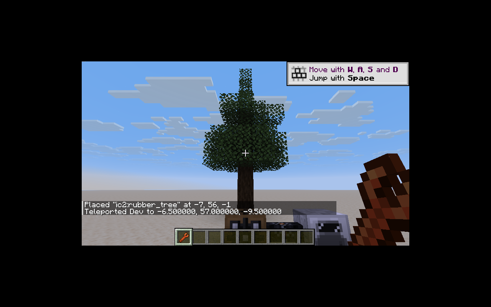
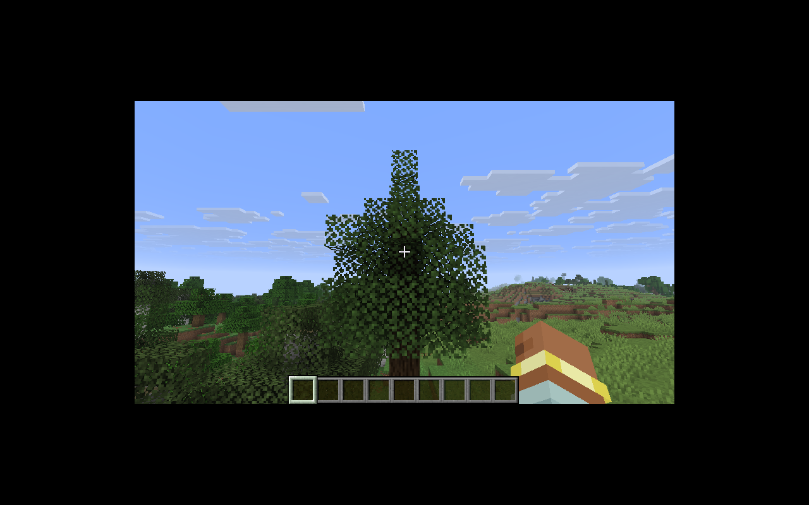

# 矿石与橡胶树

6 个矿石方块（锡／铅／铀及其深板岩变体）、橡胶原木／木头及去皮变体、树叶、树苗和木板已接入。
硬度、爆炸抗性、原矿掉落和旧生成分布保持基线；精准采集条件改用现代物品组件谓词，时运仍由原生掉落函数计算。

橡胶树通过原生 TreeGrower、ConfiguredFeature 和自定义 FoliagePlacer 的 MapCodec 注册，不在类加载时创建注册对象或异步等待全局世界生成句柄。沿用 4–8 格树干、旧树冠形状、树脂孔权重与森林／丛林／沼泽生成次数。

旧随机整数区间的 `value` 对象已展平到新版 Codec；生物群系修改器迁入 `neoforge/biome_modifier`，沼泽标签迁为 `c:is_swamp`。

树脂孔保留 `plain`、四向 `dry_*`／`wet_*` 保存名称。湿孔采集 1–3 份树脂后变干；干孔在独立的 20% 判定中可能消失、可能产出两份树脂，保留恢复代码的现有行为。
干孔每次随机刻有 1/7 概率恢复，但须经上方原木连接到树叶。向上检查受世界高度和已加载区块限制。带孔原木阻止活塞移动。
斧头剥皮通过原生工具能力接口处理，模拟查询不生成树脂；实际剥皮湿孔生成 1–2 份树脂。
手动木龙头有 16 次耐久，电动木龙头容量 10,000 EU、传输上限 100 EU、每次消耗 50 EU。

五个旧游戏事件已注册；机器活动状态切换及木龙头操作通过原生游戏事件发布。

`WorldContentTests` 验证：

- 生物群系实际包含橡胶树和全部矿石放置特征。
- 树苗使用注册配置长成有树干、树冠的橡胶树。
- 正确树脂孔方向、湿孔产出、随机恢复、无树叶时阻止恢复、活塞与电动工具消耗。
- 六种矿石的原矿／精准采集掉落，以及斧头模拟与实际剥皮。
- 三种矿脉分别在石头和深板岩区域实际生成对应矿石。

大尺寸 GameTest 场地仅在开发测试资源中，由 `tools/migration/test_structures.py` 重建。
资源生成顺序包含 `world.py`，之后运行 `material_blocks.py` 更新方块标签，再运行 `recipes.py` 更新物品标签与配方。

树叶支撑使用新版 `minecraft:prevents_nearby_leaf_decay` 标签；标签转换器递归保留有已迁移方块的嵌套引用。测试验证添加原木后距离变为 1，移除后变为 7 并自然衰减。

本地 Java 25 构建、38 项核心 JUnit 和 IC2／GT 两种模式各 43 项 GameTest（42 项 IC2 + 1 项原版）通过。客户端树冠、纹理与染色已实测。

普通地形测试存档 `IC2 Natural Generation`，种子 `2302155072022308606`，未使用放置特征命令或编辑模组方块。保存后的 1,369 个完整区块中实际存在六种矿石、707 格橡胶原木和 7,555 格橡胶树叶；这验证自然生成接入，不代表矿物分布平衡已经重新评估。生成权重保持旧版。

重新进入上述存档并到达自然树位置 `-28 78 -114`，树木保存与重载正常。

[橡胶木建筑部件](rubber-building.md) 已补齐；船只和作物继续由其他工作包迁移。
